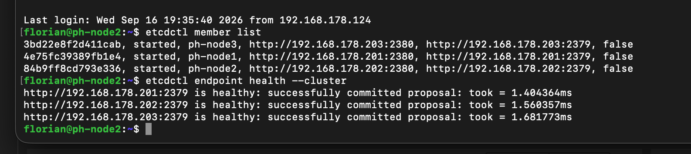

# PostgreSQL & Patroni — Lern-Tutorial

Persönliches Tutorial/Lernprotokoll, entstanden aus einem interaktiven Tutoring-Track. Ziel: PostgreSQL und Patroni (High Availability) strukturiert verstehen — erst PostgreSQL als eigenständiges System, danach HA/Patroni als zusätzliche Schicht.

Stand: 22.09.2026

---

## Teil 0 — PostgreSQL-Architektur-Grundlagen

### Der "Cluster"

In PostgreSQL nennt man das, was auf einem einzelnen Server läuft, wenn man PostgreSQL installiert und startet, einen **Cluster**. Wichtig: Das hat zunächst nichts mit mehreren Servern oder Hochverfügbarkeit zu tun (das kommt erst später bei Patroni dazu) — hier ist "Cluster" einfach eine einzelne laufende PostgreSQL-Instanz auf einer Maschine.

Ein Cluster kann **mehrere Datenbanken gleichzeitig** enthalten. Direkt nach der Installation gibt es meist schon Standard-Datenbanken: `postgres`, `template0`, `template1`. Eigene Datenbanken kommen dazu.

Besonderheit: Eine einzelne Verbindung zu Postgres ist immer nur mit **genau einer** Datenbank gleichzeitig verbunden. Man kann nicht einfach "umschalten" — dafür braucht man eine neue Verbindung (oder Spezial-Erweiterungen wie `dblink`). Die Datenbanken innerhalb eines Clusters sind stark voneinander isoliert.

### Das Data Directory (PGDATA)

Alle Datenbanken eines Clusters liegen physisch in **einem einzigen Ordner** — dem Data Directory, oft `PGDATA` genannt (z.B. `/var/lib/postgresql/16/main`).

Wichtige Inhalte:

| Pfad | Inhalt |
|---|---|
| `base/` | Die eigentlichen Tabellen-/Index-Dateien, ein Unterordner pro Datenbank |
| `pg_wal/` | Die WAL-Segmente (Write-Ahead Log) — zentral für Crash-Recovery und Replikation |
| `postgresql.conf` | Zentrale Server-Konfiguration (Speicherlimits, Logging, Netzwerk, etc.) |
| `pg_hba.conf` | "Türsteher"-Datei: legt fest, welcher Client (IP, User, Auth-Methode) sich verbinden darf |
| `postmaster.pid` | Zeigt an, dass und mit welcher Prozess-ID der Server läuft |

### MVCC (Multi-Version Concurrency Control)

PostgreSQL hat — anders als z.B. MySQL mit austauschbaren Storage-Engines (MyISAM/InnoDB) — genau **eine feste Engine**, die nach dem MVCC-Prinzip arbeitet.

Kernidee: Ein `UPDATE` überschreibt eine Zeile **nicht** an Ort und Stelle. Stattdessen wird eine komplett **neue Version** der Zeile geschrieben, und die alte Version wird nur als "veraltet" markiert (nicht sofort gelöscht). Ein `DELETE` funktioniert ähnlich. So blockieren lesende und schreibende Transaktionen sich gegenseitig nicht — jede Transaktion sieht einfach die für sie passende Version.

Diese veralteten Zeilenversionen heißen **"dead tuples"**. Es gibt kein festes Limit, wie viele davon entstehen können — das hängt z.B. davon ab, wie lange andere Transaktionen noch laufen.

### VACUUM

Damit die Tabelle nicht unbegrenzt wächst, gibt es den Hintergrundprozess **`VACUUM`** (automatisch als `autovacuum`). Er entfernt tote Tupel physisch, sobald sie wirklich niemand mehr braucht, und gibt den Platz zur Wiederverwendung frei. Ohne funktionierendes Autovacuum bläht sich eine Tabelle auf ("Table Bloat") — sie wird größer, obwohl die Datenmenge gleich bleibt, und Queries werden langsamer.

*(Vergleich zu MySQL/InnoDB: InnoDB macht intern auch MVCC, legt alte Versionen aber in einem separaten "Undo Log" ab, das von einem "Purge"-Thread aufgeräumt wird — statt wie Postgres direkt im Haupt-Tabellenspeicher ("Heap").)*

### Rollen & Berechtigungen

PostgreSQL kennt kein getrenntes Konzept von "User" und "Group" — beides heißt **"Role"**.

- Eine Rolle mit dem Attribut `LOGIN` kann sich verbinden (verhält sich wie ein "User").
- Eine Rolle ohne `LOGIN` kann sich nicht verbinden, dient nur als Container für Rechte (verhält sich wie eine "Group").
- Rollen können anderen Rollen zugewiesen werden: `GRANT rolle_name TO andere_rolle` — das vererbt Rechte (Gruppen-Pattern). Typisches Muster: ein paar Gruppen-Rollen mit klar definierten Rechten (z.B. nur Lesen) + einzelne Login-Rollen, die man in die passende Gruppe steckt statt jedes Recht einzeln zu vergeben.

### WAL & Replikation — Grundprinzip

Jede Änderung wird zuerst ins **WAL** (Write-Ahead Log) geschrieben, bevor sie als "committed" bestätigt wird. Bei **Streaming-Replikation** wird dieser WAL-Strom an eine oder mehrere Replicas geschickt, die ihn nachspielen.

Wichtiger Trade-off — **asynchrone vs. synchrone Replikation**:

- **Asynchron (Standard):** Der Primary wartet beim `COMMIT` *nicht* darauf, dass die Replica die Änderung empfangen hat. Schnell, aber: Stürzt der Primary genau in diesem Moment ab, sind die letzten committeten Änderungen, die die Replica noch nicht erreicht haben, **verloren** — sie liegen nur auf der toten Primary-Platte.
- **Synchron** (`synchronous_commit` + `synchronous_standby_names`): Der Primary wartet auf Bestätigung der Replica, bevor er dem Client "committed" meldet. Kein Datenverlust im Failover-Fall, aber höhere Latenz und ein Verfügbarkeitsrisiko, falls die Replica mal nicht erreichbar ist.

*(Dieses Thema wird in einer späteren Lektion noch vertieft, sobald Streaming-Replikation praktisch aufgesetzt wird.)*

### Wichtig: PostgreSQL funktioniert auch komplett ohne Patroni

Die überwiegende Mehrheit aller PostgreSQL-Installationen läuft als einzelne, eigenständige Instanz ohne jede Replikation oder HA-Tooling. **Patroni** kommt erst ins Spiel, wenn man mehrere PostgreSQL-Instanzen zu einem hochverfügbaren Verbund mit automatischem Failover zusammenschalten will. Patroni speichert selbst keine Daten — es ist ein Orchestrator "von außen", der mehrere eigenständige PostgreSQL-Cluster überwacht und im Ernstfall einen Failover durchführt. PostgreSQL selbst "weiß" nichts von Patroni.

→ Deshalb: Erst PostgreSQL solo verstehen und einsetzen können, Patroni kommt danach als zusätzliche Schicht.

---

## Teil 1 — Hands-on: PostgreSQL Installation

### Umgebung

- Parallels-VM auf Mac (Apple Silicon / ARM), unabhängig vom Proxmox-Homelab
- Ubuntu 24.04.4 LTS ("noble"), Hostname `ubuntu-gnu-linux-24-04-3`
- Linux-User: `parallels`

### Installation

```bash
sudo apt update
sudo apt install -y postgresql postgresql-contrib
```

- `postgresql` — Kernpaket (Server + Client-Tools)
- `postgresql-contrib` — nützliche Zusatz-Erweiterungen

Ergebnis: PostgreSQL **16.15** (Ubuntu-Paket, aarch64-Build) installiert, keine Fehler. Cluster `16/main` wurde automatisch angelegt unter `/var/lib/postgresql/16/main` (= das PGDATA-Verzeichnis aus Teil 0). Der Installer legt außerdem automatisch einen Linux-Systembenutzer `postgres` (Besitzer der Dateien) sowie eine gleichnamige PostgreSQL-Superuser-Rolle `postgres` an.

### Dienst prüfen

```bash
sudo systemctl status postgresql
```

Hinweis: `postgresql.service` ist bei Ubuntu nur ein **Meta-Service**, der prüft, ob alle installierten Cluster-Versionen laufen, und sich dann selbst beendet (`active (exited)` ist normal!). Der eigentliche Serverprozess läuft unter einem versionierten Service, z.B. `postgresql@16-main`.

### Erste Verbindung (als Superuser)

```bash
sudo -i -u postgres psql
```

Im `psql`-Prompt getestet:

```sql
SELECT version();
```

→ Bestätigt: `PostgreSQL 16.15 (Ubuntu 16.15-0ubuntu0.24.04.1) on aarch64-unknown-linux-gnu`.

### Eigene Rolle + Datenbank anlegen (Praxis zu Teil 0)

Statt dauerhaft als Superuser `postgres` zu arbeiten, wurde eine eigene Login-Rolle plus Datenbank angelegt:

```sql
CREATE ROLE flo WITH LOGIN PASSWORD 'ein_test_passwort';
CREATE DATABASE testdb OWNER flo;
```

### Verbindung als neue Rolle — peer vs. host Authentifizierung

```bash
psql -h localhost -U flo -d testdb
```

Wichtiges Detail: Ohne `-h localhost` würde die Verbindung über den lokalen Unix-Socket laufen, und dort gilt standardmäßig **"peer"-Authentifizierung** — der Linux-Login-Name muss exakt mit dem Postgres-Rollennamen übereinstimmen (deshalb funktionierte `sudo -i -u postgres psql` ohne Passwort). Mit `-h localhost` wird eine TCP-Verbindung erzwungen, für die eine andere Regel in `pg_hba.conf` greift — dort wird ein Passwort verlangt (scram-sha-256), passend zum vorher gesetzten Passwort für `flo`.

Erkennungsmerkmal im Prompt: `testdb=>` (statt `testdb=#`) zeigt an, dass man **kein** Superuser mehr ist.

---

## Teil 2 — Rollen-Rechte in der Praxis & pg_hba.conf

### Rechte-Grenzen live getestet

Als nicht-Superuser-Rolle `flo` in `testdb` ausprobiert:

```sql
CREATE TABLE notizen (id SERIAL PRIMARY KEY, text TEXT);
```
→ **Funktioniert** — `flo` ist Besitzer von `testdb`, darf also Tabellen anlegen.

```sql
CREATE ROLE noch_ein_user WITH LOGIN;
```
→ **Permission denied** — `CREATE ROLE` ist ein Superuser-Recht (bzw. braucht das `CREATEROLE`-Attribut), das `flo` nicht hat. Bestätigt live, dass die Rollen-Rechte aus Teil 0 tatsächlich greifen.

### pg_hba.conf im Detail

Wichtiger Hinweis zur Ubuntu/Debian-Paketierung: `postgresql.conf` und `pg_hba.conf` liegen bei Debian-basierten Systemen **nicht** im Data Directory, sondern unter `/etc/postgresql/16/main/` (Debian-Konvention: Konfiguration unter `/etc`). Die eigentlichen Daten bleiben unter `/var/lib/postgresql/16/main`.

Angeschaut mit:
```bash
sudo grep -v '^#' /etc/postgresql/16/main/pg_hba.conf | grep -v '^$'
```

Format jeder Zeile: `TYPE  DATABASE  USER  ADDRESS  METHOD`. Regeln werden von oben nach unten geprüft, **erste passende Zeile gewinnt**.

Inhalt (Standard-Konfiguration nach Installation):

```
local   all             postgres                                peer
local   all             all                                     peer
host    all             all             127.0.0.1/32            scram-sha-256
host    all             all             ::1/128                 scram-sha-256
local   replication     all                                     peer
host    replication     all             127.0.0.1/32            scram-sha-256
host    replication     all             ::1/128                 scram-sha-256
```

Erklärung der wichtigsten Zeilen:
- `local all postgres peer` — warum `sudo -i -u postgres psql` ohne Passwort funktioniert (Linux-User `postgres` == Rolle `postgres`).
- `local all all peer` — warum eine lokale Verbindung als `flo` (ohne `-h localhost`) NICHT funktioniert hätte: kein Linux-User `flo` vorhanden.
- `host all all 127.0.0.1/32 scram-sha-256` — warum `psql -h localhost -U flo -d testdb` nach einem Passwort fragt (TCP-Verbindung → diese Regel statt peer).
- Die `replication`-Zeilen sind Sonderregeln für die Pseudo-Datenbank `replication`, die für WAL-Streaming zwischen Primary und Replica gebraucht wird — aktuell nur von localhost erlaubt.

**Für eine echte Replica auf einer zweiten Maschine später nötig:**
1. Neue Zeile in `pg_hba.conf` mit der IP/dem Subnetz der Replica, z.B. `host replication replicator_user 192.168.178.0/24 scram-sha-256` (neue Zeile hinzufügen, bestehende nicht überschreiben).
2. Zusätzlich `listen_addresses` in `postgresql.conf` anpassen (Standard: nur `localhost`) — `pg_hba.conf` regelt *wer* darf, `listen_addresses` regelt *wo der Server überhaupt lauscht*. Ohne Anpassung von `listen_addresses` kommen externe Verbindungsversuche gar nicht erst an.

## Teil 3 — Streaming-Replikation live aufgesetzt

Für den ersten praktischen Replikations-Versuch wurde **auf derselben VM** ein zweiter PostgreSQL-Prozess auf einem anderen Port als Replica eingerichtet (statt gleich einer zweiten Maschine) — zeigt den vollen Mechanismus ohne zusätzliche Netzwerk-Komplexität. Eine echte zweite Maschine kommt später für den vollen Patroni-Aufbau.

### 1. Replikations-Rolle auf dem Primary

```sql
CREATE ROLE replicator WITH REPLICATION LOGIN PASSWORD 'replica_pass_123';
```

Das `REPLICATION`-Attribut ist unabhängig von normalen Tabellenrechten — nur Rollen damit (oder Superuser) dürfen den WAL-Stream abonnieren.

### 2. Basis-Backup ziehen

```bash
sudo -u postgres pg_basebackup -h 127.0.0.1 -p 5432 -U replicator -D /var/lib/postgresql/16/replica -P -R
```

- `-D` — Zielverzeichnis, wird das neue PGDATA der Replica
- `-R` — schreibt automatisch `standby.signal` + Verbindungsdaten zum Primary (Postgres 12+)
- Die bestehende `pg_hba.conf`-Regel `host replication all 127.0.0.1/32 scram-sha-256` erlaubte das sofort, keine Änderung nötig (nur lokal).

**Stolperfalle (Debian-spezifisch):** `pg_basebackup` kopiert nur, was tatsächlich im Data Directory liegt. Da Debian/Ubuntu `pg_hba.conf`/`postgresql.conf` nach `/etc/postgresql/16/main/` auslagert (siehe Teil 2), fehlten beide Dateien in der Kopie komplett → Start schlug fehl (`could not load .../replica/pg_hba.conf`). Fix: Dateien manuell in den Replica-Datenordner kopieren, da eine manuell gestartete Instanz (ohne Debian-Cluster-Tooling) sie dort standardmäßig sucht:

```bash
sudo cp /etc/postgresql/16/main/pg_hba.conf /var/lib/postgresql/16/replica/pg_hba.conf
sudo chown postgres:postgres /var/lib/postgresql/16/replica/pg_hba.conf
```

### 3. Port setzen & Replica starten

```bash
echo "port = 5433" | sudo tee -a /var/lib/postgresql/16/replica/postgresql.conf
sudo -u postgres /usr/lib/postgresql/16/bin/pg_ctl -D /var/lib/postgresql/16/replica -l /var/lib/postgresql/16/replica/logfile start
```

→ `server started`. Manuell mit `pg_ctl` statt über den Debian-Service, da dieser zweite Cluster nicht in dessen Verwaltung registriert ist.

### 4. Verifiziert

```sql
-- auf dem Primary:
SELECT client_addr, state, sync_state FROM pg_stat_replication;
-- → 127.0.0.1 | streaming | async

-- auf der Replica (Port 5433):
SELECT pg_is_in_recovery();
-- → t
```

`pg_is_in_recovery()` ist die Funktion, mit der eine Anwendung (oder später Patroni/HAProxy) programmatisch prüfen kann, ob eine Instanz Primary oder Replica ist.

### 5. Live-Test: Schreiben auf Primary, Lesen auf Replica

```bash
psql -h 127.0.0.1 -p 5432 -U flo -d testdb -c "INSERT INTO notizen (text) VALUES ('Hallo von Primary');"
psql -h 127.0.0.1 -p 5433 -U flo -d testdb -c "SELECT * FROM notizen;"
```
→ Die Zeile "Hallo von Primary" erscheint auf der Replica, obwohl sie nur auf dem Primary eingefügt wurde. Replikation bestätigt Ende-zu-Ende.

*(Nebenbei gelernt: Ein `!` in einem doppelt gequoteten Bash-`-c`-String löst History-Expansion aus (`bash: !': event not found`) und lässt den Befehl gar nicht erst laufen — reine Shell-Falle, nichts mit Postgres zu tun.)*

### 6. Replica ist read-only

```bash
psql -h 127.0.0.1 -p 5433 -U flo -d testdb -c "INSERT INTO notizen (text) VALUES ('Test von Replica');"
```
→ `ERROR: cannot execute INSERT in a read-only transaction`. Bestätigt: Eine Streaming-Replica nimmt niemals eigene Schreibbefehle an, sie spielt ausschließlich den WAL vom Primary nach.

## Teil 4 — Manueller Failover live durchgeführt

### Warum HA nötig ist

Ein einzelner PostgreSQL-Server ist ein Single Point of Failure — Hardwaredefekt, OS-Crash, geplante Wartung, menschlicher Fehler. Fällt er aus, ist die Anwendung tot, bis jemand manuell eingreift.

### Was "manuell eingreifen" konkret bedeutet

1. Feststellen, dass der Primary wirklich tot ist (nicht nur kurz nicht erreichbar)
2. Die Replica befördern ("promote")
3. Die Anwendung auf die neue Primary umbiegen
4. Den alten Primary später sauber aufräumen (darf nicht einfach als Primary wieder starten — Datenstand könnte abweichen)

Jeder Schritt kostet Zeit — genau die Downtime, die HA/Patroni auf Sekunden reduzieren soll.

### Split-Brain-Gefahr

Wird eine Replica befördert, während der alte Primary in Wirklichkeit noch läuft (z.B. nur Netzwerkproblem statt echtem Absturz), entstehen **zwei gleichzeitig aktive Primaries**, die unabhängig voneinander Schreibzugriffe annehmen — **Split-Brain**, potenziell nicht mehr reparierbarer Datenwiderspruch. Genau dieses Problem macht einen zuverlässigen Konsens-Mechanismus (etcd/Raft) für automatisierte Failover-Systeme nötig.

### Live durchgeführt

```bash
# Primary "abstürzen lassen"
sudo systemctl stop postgresql@16-main

# Bestätigt: App wäre jetzt tot
psql -h 127.0.0.1 -p 5432 -U flo -d testdb -c "SELECT 1;"
# → Connection refused

# Replica (Port 5433) zur neuen Primary befördern
sudo -u postgres /usr/lib/postgresql/16/bin/pg_ctl -D /var/lib/postgresql/16/replica promote
# → server promoted

# Bestätigt: kein Standby mehr
psql -h 127.0.0.1 -p 5433 -U flo -d testdb -c "SELECT pg_is_in_recovery();"
# → f

# Bestätigt: nimmt jetzt Schreibzugriffe an
psql -h 127.0.0.1 -p 5433 -U flo -d testdb -c "INSERT INTO notizen (text) VALUES ('Ich bin jetzt Primary');"
# → INSERT 0 1
```

Kompletter manueller Failover erfolgreich durchgeführt und verifiziert. Offen (bewusst nicht gemacht): alten Primary (5432) sauber als neue Replica der jetzigen Primary (5433) wieder einrichten.

## Teil 5 — Konsensus-Problem & etcd/Raft

### Das Problem

Bei mehreren PostgreSQL-Knoten (z.B. 3, orchestriert von Patroni) muss im Ausfallfall irgendjemand zuverlässig entscheiden: "Der alte Primary ist wirklich tot, wir befördern jetzt eine Replica." Dürfte jeder Knoten das für sich selbst entscheiden, landet man sofort wieder beim Split-Brain-Problem (siehe Teil 4) — besonders bei Netzwerkproblemen, bei denen unterschiedliche Knoten unterschiedliche Sichten auf die Lage haben.

### Die Lösung: Mehrheits-Konsensus (Raft)

**Raft** (implementiert von **etcd**) löst das über ein Mehrheitsprinzip: Eine Entscheidung gilt nur dann als gültig, wenn eine **Mehrheit (Quorum)** aller Knoten zustimmt — nie nur ein einzelner Knoten für sich.

Beispiel bei 3 Knoten: Ein Netzwerkproblem teilt den Cluster in eine Gruppe von 2 und einen isolierten Einzelknoten. Die Gruppe von 2 hat die Mehrheit (2 von 3) und darf handeln (z.B. neuen Leader wählen). Der isolierte Knoten weiß: keine Mehrheit → darf sich NICHT selbst zum Leader machen, auch wenn er den Rest nicht mehr sieht. Split-Brain wird so zuverlässig verhindert.

### Warum ungerade Knotenzahl (3, 5, 7 statt 2, 4, 6)

Bei einer geraden Anzahl (z.B. 4) kann sich der Cluster exakt 50/50 aufteilen (2 vs. 2) — keine Seite hat die nötige Mehrheit (bräuchte 3 von 4). Ergebnis: Der Cluster "friert ein", niemand wählt einen neuen Leader, bis die Verbindung wiederhergestellt ist. Lieber kurzzeitig keine Verfügbarkeit als zwei widersprüchliche Leader gleichzeitig. Bei ungerader Knotenzahl ist ein exaktes Patt rechnerisch unmöglich.

### Rolle von etcd für Patroni

Patroni erfindet dieses Konsensus-Problem nicht neu, sondern nutzt etcd als fertiges, battle-tested System dafür. Patroni selbst führt keine eigene Wahl durch — es schreibt/liest lediglich einen Eintrag in etcd (z.B. "wer ist aktuell der Primary"), und etcd sorgt intern über Raft dafür, dass sich alle Knoten auf genau einen konsistenten Stand einigen.

## Teil 6 — Was Patroni konkret macht

Patroni ist ein eigenständiger (Python-)Agent-Prozess, der auf **jedem** Knoten neben der jeweiligen PostgreSQL-Instanz läuft (nicht in Postgres eingebaut). Auf einem 3-Knoten-Cluster laufen also 3× PostgreSQL + 3× Patroni.

Was Patroni automatisiert — direkt gespiegelt an den manuellen Schritten aus Teil 4:

1. **Verwaltet den lokalen PostgreSQL-Prozess** (start/stop/konfigurieren) — automatisiert das, was wir von Hand mit `pg_ctl` gemacht haben.
2. **Leader-Election über etcd**: Der Patroni-Prozess auf dem aktuellen Primary hält in etcd einen "Leader Lock" mit Ablaufzeit (TTL), den er laufend erneuert (Herzschlag). Bleibt der Herzschlag aus, läuft der Lock ab.
3. **Automatischer Failover**: Sobald der Lock frei wird, konkurrieren die übrigen Patroni-Prozesse darum — dank etcd/Raft-Mehrheitsprinzip kann garantiert nur einer gewinnen. Der Gewinner befördert seine lokale Instanz automatisch (der `pg_ctl promote`-Schritt von vorhin, jetzt automatisiert).
4. **REST-API** (Standard-Port 8008) je Knoten: Beantwortet "bist du gerade Primary oder Replica?". Wird von HAProxy für Health-Checks genutzt.
5. Versucht in der Regel auch, einen wiederkehrenden alten Primary automatisch als neue Replica einzugliedern (Detail für später, klappt nicht immer ohne manuellen Eingriff).

### Die verbleibende Lücke: Anwendung umbiegen

Patroni weiß intern, wer Primary ist — aber die Anwendung selbst nicht automatisch. Genau das übernimmt **HAProxy**: Es sitzt als stabiler Eintrittspunkt vor allen Knoten, fragt laufend über Patronis REST-API ab, wer gerade Primary ist, und leitet Verbindungen ausschließlich dorthin. Die Anwendung verbindet sich immer mit derselben HAProxy-Adresse und merkt vom Failover im Hintergrund nichts.

## Offene nächste Schritte

- HAProxy (Health-Checks, Routing zum Primary)
- keepalived / Virtual IP (VRRP)
- Referenz-Gesamtarchitektur: [technotim.live PostgreSQL-HA-Anleitung](https://technotim.live/posts/postgresql-high-availability/) (3-Knoten-Cluster: PostgreSQL + etcd + Patroni + HAProxy + keepalived)

---

## Teil 7 — Capstone-Projekt: Echter 3-Knoten-Cluster auf Proxmox

Ab hier verlassen wir die Single-VM-Testumgebung (Parallels) und bauen den Cluster real auf drei Proxmox-VMs nach. Projekt-Repo: [github.com/florian-englmeier/postgresql-ha-lab](https://github.com/florian-englmeier/postgresql-ha-lab) (MIT-Lizenz).

### Strategie: Ein Template klonen statt dreimal von Hand installieren

Statt drei VMs komplett einzeln aufzusetzen: eine VM (`ph-node1`) vollständig mit allen Paketen vorbereiten, dann zweimal klonen. Wichtige Regel dabei: Alles, was auf allen Knoten **identisch** sein muss (Pakete), kommt vor dem Klonen rein. Alles, was pro Knoten **eindeutig** sein muss (Hostname, IP, `machine-id`, SSH-Host-Keys, spätere Patroni-/etcd-Config), wird bewusst **nach** dem Klonen, pro Knoten einzeln, konfiguriert — sonst kollidieren die Klone im Netzwerk.

### Netzwerk- und Sizing-Schema

Heimnetz `192.168.178.0/24` (Fritzbox-DHCP bis `.254`), IPs vorab per Ping + Fritzbox-Geräteliste als frei verifiziert:

| Knoten | VMID | Hostname | IP |
|---|---|---|---|
| Node 1 | 201 | ph-node1 | 192.168.178.201 |
| Node 2 | 202 | ph-node2 | 192.168.178.202 |
| Node 3 | 203 | ph-node3 | 192.168.178.203 |
| Virtuelle IP (später, HAProxy/keepalived) | — | — | 192.168.178.200 |

Sizing pro Knoten: 2 vCPU / 4 GB RAM / 20 GB Disk (für dieses Lernprojekt ausreichend — PostgreSQL, Patroni und etcd sind im Leerlauf alle drei genügsam; erst bei Lasttests oder großen Datenmengen würde man hier nachlegen).

OS: **Ubuntu Server 24.04 LTS**, volle Server-Version (nicht "minimized" — mehr Debug-Komfort für's Tutorial), OpenSSH-Server bei Installation aktiviert, keine Featured Snaps installiert (bewusst alles klassisch über `apt`/`pip` statt Snap, für konsistente, dokumentierbare Config-Pfade).

Proxmox-VM-Netzwerk: Bridge `vmbr0`, Modell **VirtIO (paravirtualized)** — treiberbasierter virtueller Adapter, der (im Gegensatz zu einem emulierten Adapter wie Intel E1000) weiß, dass er virtualisiert läuft, und direkter mit dem Hypervisor kommuniziert: spürbar schneller, weniger CPU-Overhead. Ubuntu 24.04 bringt die nötigen VirtIO-Treiber von Haus aus mit.

Statische IP wurde direkt im Ubuntu-Installer gesetzt (Subiquity, manueller IPv4-Modus) statt per DHCP + Fritzbox-Reservierung — einfacher, weil die Netplan-Config (`/etc/netplan/00-installer-config.yaml`) beim Klonen sowieso pro Knoten angepasst werden muss.

*Kleiner Exkurs Subnetzmaske:* `/24` (CIDR) und `255.255.255.0` (klassische Maske) sind zwei Schreibweisen für **dieselbe** Sache — `/24` heißt "die ersten 24 Bit der Adresse sind der Netzwerk-Anteil" (binär: `11111111.11111111.11111111.00000000`), umgerechnet exakt `255.255.255.0`. Man kombiniert nie beide Schreibweisen gleichzeitig.

### Paket-Installation auf dem Template (ph-node1)

```bash
sudo apt update && sudo apt upgrade -y
sudo apt install -y postgresql postgresql-contrib python3-pip python3-psycopg2 etcd-server etcd-client
sudo pip install patroni[etcd] --break-system-packages
```

Ergebnis: PostgreSQL 16.15, Patroni 4.1.5, etcdctl 3.4.30.

Zwei Dinge zu dieser Zeile, die leicht zu verwechseln sind:

- **`patroni[etcd]`** — pip-"Extras"-Syntax: installiert Patroni-Kern **plus** die passende Python-Client-Bibliothek für den gewählten Consensus-Store (Patroni unterstützt neben etcd auch Consul, ZooKeeper u.a.).
- **`--break-system-packages`** — kein Paket, sondern eine reine `pip`-Kommandozeilen-Option, die Ubuntu 24.04s PEP-668-Schutz (`externally-managed-environment`) bewusst übersteuert. Der Schutz verhindert normalerweise, dass `pip` versehentlich das von `apt` verwaltete System-Python durcheinanderbringt. Für eine dedizierte Single-Purpose-VM (läuft nur Patroni) ist das Risiko vernachlässigbar.

`etcd` kommt bewusst über `apt`, nicht `pip` — es ist ein in Go geschriebenes, fertig kompiliertes Binary, kein Python-Paket.

### Cleanup vor dem Klonen

Sowohl `etcd` als auch `postgresql` starten nach der Installation automatisch mit einer Default-Einzelknoten-Konfiguration — das würde beim Klonen mitkopiert und später Probleme machen (analog zum `machine-id`-Problem, nur auf Anwendungsebene):

```bash
# etcd hat sich bereits selbst zum Einzelknoten-Cluster-Leader gewählt und Daten
# unter /var/lib/etcd abgelegt — den richtigen 3-Knoten-Cluster bauen wir erst,
# wenn alle IPs feststehen (nächster Schritt)
sudo systemctl stop etcd
sudo systemctl disable etcd
sudo rm -rf /var/lib/etcd/*

# PostgreSQL-Autostart deaktivieren — Patroni übernimmt die Prozess-Steuerung
# später komplett selbst, der systemd-Autostart würde dem in die Quere kommen
sudo systemctl stop postgresql
sudo systemctl disable postgresql
```

### Geplante Post-Klon-Schritte (pro Klon einzeln, über die Proxmox-Konsole — nicht SSH, da die Klone anfangs dieselbe IP wie das Template haben und SSH bei IP-Konflikt unzuverlässig ist)

- Hostname ändern (`ph-node2` / `ph-node3`)
- Netplan-IP ändern (`/etc/netplan/00-installer-config.yaml`, dann `sudo netplan apply` — sofortige Übernahme ohne Reboot)
- `machine-id` neu generieren
- SSH-Host-Keys neu generieren

### Status

`ph-node1` fertig installiert und für den Klon vorbereitet. Als Nächstes: `ph-node1` sauber herunterfahren, in Proxmox zweimal als Full Clone (nicht Linked Clone) auf VMID 202/203 kopieren.

### Exkurs: Git — "fetch first" beim ersten Push ins GitHub-Repo

Beim Verbinden des lokalen Projektordners mit dem auf GitHub.com bereits angelegten Repo trat folgender Fehler auf:

```
! [rejected]        main -> main (fetch first)
error: failed to push some refs to 'https://github.com/florian-englmeier/postgresql-ha-lab.git'
```

**Ursache:** Beim Anlegen des Repos über die GitHub-Weboberfläche hatte GitHub automatisch schon einen ersten Commit im `main`-Branch erzeugt (typisch, wenn beim Erstellen z.B. "Add a README file" oder eine Lizenzvorlage angehakt ist). Lokal wurde das Verzeichnis dagegen mit `git init` als **komplett neues, unabhängiges Repo** gestartet — eine eigene Commit-Historie ganz ohne Bezug zum GitHub-Commit.

Git erlaubt einen `push` standardmäßig nur als **Fast-Forward**: Der aktuelle Stand des Remote-Branches muss ein direkter Vorfahre dessen sein, was hochgeladen wird. Da hier zwei völlig getrennte Wurzel-Commits aufeinandertrafen, hätte ein einfacher Push den GitHub-Commit stillschweigend überschrieben — das verhindert Git bewusst mit dieser Fehlermeldung.

**Lösung:**

```bash
git fetch origin
git merge origin/main --allow-unrelated-histories -X ours -m "merge: lokale README/LICENSE behalten"
git push -u origin main
```

- `--allow-unrelated-histories` — erlaubt das Zusammenführen zweier Repos ohne gemeinsamen Ursprungs-Commit (Git verweigert das sonst standardmäßig als Sicherheitsmaßnahme).
- `-X ours` — bei echten Datei-Konflikten (z.B. beide Seiten haben eine `README.md`) gewinnt automatisch die lokale Version, ohne manuelle Konfliktauflösung.

Ergebnis: ein Merge-Commit mit **zwei Elternteilen** (lokaler Wurzel-Commit + GitHub-Wurzel-Commit), der beide Historien zusammenführt. Sichtbar mit:

```bash
git log --oneline --graph --all --decorate
```

Danach war der lokale `main`-Branch ein echter Fast-Forward-Nachfolger des Remote-Standes, der Push ging durch.

## Teil 8 — etcd als 3-Knoten-Cluster konfigurieren

Bisher lief etcd auf jedem Knoten isoliert für sich (deaktiviert und mit leerem Datenverzeichnis seit dem Klon-Cleanup). Jetzt bringen wir den drei Knoten bei, sich gegenseitig zu finden und gemeinsam den Raft-Cluster zu bilden, den wir konzeptionell schon aus Teil 5 kennen.

### Zwei getrennte Kommunikationskanäle

Man kann sich die drei etcd-Prozesse als ein dreiköpfiges Gremium vorstellen, das per Raft gemeinsam Entscheidungen trifft. Dieses Gremium braucht zwei unterschiedliche Kanäle:

- **Peer-Kanal, Port `2380`** — die private Leitung zwischen den Knoten selbst: Abstimmen, Protokolle abgleichen, Leader wählen.
- **Client-Kanal, Port `2379`** — der öffentliche Schalter, an dem Außenstehende (später: Patroni) Fragen stellen ("wer ist gerade Primary?").

Deshalb gibt es in der Config-Datei für jeden Kanal ein eigenes Adress-Paar.

### "Listen" vs. "Advertise" — der typische Stolperstein

- **Listen** beantwortet: "An welchen Türen meines eigenen Hauses nehme ich Besuch an?" — rein lokal, auf der Maschine selbst (inkl. `127.0.0.1` für lokalen Zugriff).
- **Advertise** beantwortet: "Welche Adresse gebe ich anderen, damit sie mich von außen finden?" — muss eine im Netz erreichbare, echte IP sein. `127.0.0.1` wäre hier nutzlos, weil das für einen anderen Knoten "ich selbst" bedeuten würde, nicht "der andere Knoten".

Jeder Knoten lauscht auf seiner eigenen Adresse (Listen) UND ruft gleichzeitig aktiv die Advertise-Adressen der beiden anderen an — das läuft in beide Richtungen parallel, keine Einbahnstraße.

### Das gemeinsame Adressbuch: `ETCD_INITIAL_CLUSTER`

Diese Zeile muss auf **allen drei Knoten identisch** sein — sie ist das gemeinsame Adressbuch: "hier sind Namen und Adressen aller drei Gründungsmitglieder". Ohne dieses Adressbuch wüsste keiner der drei, wen er überhaupt kontaktieren soll.

Zwei weitere Einstellungen dazu:

- **`ETCD_INITIAL_CLUSTER_STATE="new"`** — sagt den dreien: "Wir gründen hier gerade gemeinsam einen brandneuen Cluster." (Im Unterschied zu `"existing"`, das man nutzen würde, um einem bereits laufenden Cluster später einen vierten Knoten hinzuzufügen.)
- **`ETCD_INITIAL_CLUSTER_TOKEN`** — ein eindeutiger Name für genau diesen einen Cluster. Rein theoretisch könnten im selben Netzwerk mehrere unabhängige etcd-Cluster existieren — der Token verhindert, dass die sich versehentlich vermischen, falls sich z. B. IP-Bereiche überschneiden würden.

### Die Config-Dateien

`/etc/default/etcd` auf jedem Knoten (Debian/Ubuntu-Paket liest diese Environment-Datei beim Start des systemd-Dienstes ein). Gleicher Aufbau auf allen drei Knoten, nur `ETCD_NAME` und die eigene IP in den vier "eigenen" Zeilen ändern sich — `ETCD_INITIAL_CLUSTER`, `_STATE` und `_TOKEN` bleiben überall identisch:

```bash
# ph-node1 (192.168.178.201)
sudo tee /etc/default/etcd > /dev/null <<'CFG'
ETCD_NAME="ph-node1"
ETCD_DATA_DIR="/var/lib/etcd/default.etcd"
ETCD_INITIAL_CLUSTER="ph-node1=http://192.168.178.201:2380,ph-node2=http://192.168.178.202:2380,ph-node3=http://192.168.178.203:2380"
ETCD_INITIAL_CLUSTER_STATE="new"
ETCD_INITIAL_CLUSTER_TOKEN="ph-etcd-cluster-1"
ETCD_INITIAL_ADVERTISE_PEER_URLS="http://192.168.178.201:2380"
ETCD_LISTEN_PEER_URLS="http://192.168.178.201:2380,http://127.0.0.1:2380"
ETCD_LISTEN_CLIENT_URLS="http://192.168.178.201:2379,http://127.0.0.1:2379"
ETCD_ADVERTISE_CLIENT_URLS="http://192.168.178.201:2379"
CFG
```

Auf `ph-node2` und `ph-node3` derselbe Block mit `ETCD_NAME`, `ETCD_INITIAL_ADVERTISE_PEER_URLS`, `ETCD_LISTEN_PEER_URLS`, `ETCD_LISTEN_CLIENT_URLS` und `ETCD_ADVERTISE_CLIENT_URLS` auf die jeweils eigene IP (`.202` bzw. `.203`) angepasst.

Aktivieren und starten (Reihenfolge egal — etcd wartet von selbst, bis es die anderen erreicht):

```bash
sudo systemctl enable etcd
sudo systemctl start etcd
```

Cluster-Gesundheit prüfen (auf einem beliebigen Knoten):

```bash
etcdctl member list
etcdctl endpoint health --cluster
```

**Ergebnis (verifiziert am 16.09.2026):** Alle drei Knoten haben sich gefunden, jeder mit eigener Member-ID im Status `started`, und der Health-Check bestätigt für alle drei Endpoints ein erfolgreich committetes Proposal — das Mehrheitsprinzip funktioniert nicht nur theoretisch, sondern live:



## Teil 9 — Patroni konfigurieren und Cluster starten

Datenverzeichnis (`/var/lib/postgresql/16/patroni`, `postgres:postgres`, `chmod 700`) und `patroni.yml` auf jedem Knoten angelegt (Details siehe Config-Auszug oben in der Session-Historie — `scope`, `restapi`, `etcd3` und `postgresql`-Block jeweils mit der eigenen IP, Replikations-/Superuser-Passwort auf allen drei Knoten identisch).

### systemd-Unit

`pip install` legt keinen systemd-Dienst an — selbst geschrieben, identisch auf allen drei Knoten unter `/etc/systemd/system/patroni.service`:

```ini
[Unit]
Description=Patroni PostgreSQL HA
After=network.target etcd.service
Requires=etcd.service

[Service]
Type=simple
User=postgres
Group=postgres
ExecStart=/usr/local/bin/patroni /etc/patroni.yml
ExecReload=/bin/kill -s HUP $MAINPID
KillMode=process
TimeoutSec=30
Restart=on-failure

[Install]
WantedBy=multi-user.target
```

`User=postgres`, weil Patroni die PostgreSQL-Binaries startet und die aus Sicherheitsgründen nicht als root laufen dürfen. `Requires=etcd.service` stellt sicher, dass der lokale etcd-Dienst garantiert läuft, bevor Patroni startet.

### Was beim ersten Start automatisch passiert

Alle drei Patroni-Prozesse versuchen beim Start gleichzeitig, sich in etcd als Initiator einzutragen — dank Raft/Mehrheitsprinzip gewinnt genau einer. Der Gewinner führt `initdb` aus und wird automatisch **Leader**. Die anderen beiden erkennen über etcd, dass bereits ein Leader existiert, und ziehen sich automatisch per `pg_basebackup` eine Kopie davon — werden also automatisch zu **Replicas**. Das ist exakt der Automatisierungsschritt aus Teil 6, jetzt live beobachtet statt nur konzeptionell.

```bash
sudo systemctl daemon-reload
sudo systemctl enable patroni
sudo systemctl start patroni
```

### Verifiziert (17.09.2026)

```
florian@ph-node2:~$ patronictl -c /etc/patroni.yml list
+ Cluster: postgres-ha (7686474206101860353) ------+----+-------------+-----+------------+-----+
| Member   | Host            | Role    | State     | TL | Receive LSN | Lag | Replay LSN | Lag |
+----------+-----------------+---------+-----------+----+-------------+-----+------------+-----+
| ph-node1 | 192.168.178.201 | Leader  | running   |  1 |             |     |            |     |
| ph-node2 | 192.168.178.202 | Replica | streaming |  1 |   0/5047D30 |   0 |  0/5047D30 |   0 |
| ph-node3 | 192.168.178.203 | Replica | streaming |  1 |   0/5047D30 |   0 |  0/5047D30 |   0 |
+----------+-----------------+---------+-----------+----+-------------+-----+------------+-----+
```

`ph-node1` hat das Rennen gewonnen und ist Leader, `ph-node2`/`ph-node3` sind Replicas im Zustand `streaming` mit **Lag = 0** in beiden Spalten (Receive und Replay LSN) — vollständig synchron, alle auf derselben Timeline (`TL 1`).

## Teil 10 — HAProxy: automatisches Routing zur aktuellen Primary

HAProxy soll nie selbst "wissen" müssen, wer gerade Primary ist — das würde die Config ständig veralten lassen. Stattdessen nutzt es Patronis REST-API (Port 8008): Der Pfad `/primary` antwortet mit HTTP **200**, wenn der jeweilige Knoten gerade Primary ist, und mit **503**, wenn er Replica ist. HAProxy fragt das laufend bei allen drei Knoten ab und leitet echten PostgreSQL-Traffic (Port 5432) ausschließlich an den einen Knoten weiter, der gerade mit 200 antwortet. Fällt der Primary aus und Patroni befördert automatisch eine Replica, schwenkt HAProxy automatisch um — ganz ohne manuellen Eingriff.

Praktischer Vorteil dieser Konfiguration: Sie ist auf **allen drei Knoten identisch** (zeigt ja nur auf feste IPs, nicht auf "sich selbst") — keine Anpassung pro Knoten nötig, anders als bei etcd und Patroni.

```bash
sudo apt install -y haproxy

sudo tee /etc/haproxy/haproxy.cfg > /dev/null <<'CFG'
global
    maxconn 100

defaults
    log global
    mode tcp
    retries 2
    timeout client 30m
    timeout connect 4s
    timeout server 30m
    timeout check 5s

listen stats
    mode http
    bind *:7000
    stats enable
    stats uri /

listen postgres
    bind *:5000
    option httpchk GET /primary
    http-check expect status 200
    default-server inter 3s fall 3 rise 2 on-marked-down shutdown-sessions
    server ph-node1 192.168.178.201:5432 maxconn 100 check port 8008
    server ph-node2 192.168.178.202:5432 maxconn 100 check port 8008
    server ph-node3 192.168.178.203:5432 maxconn 100 check port 8008
CFG

sudo systemctl enable haproxy
sudo systemctl restart haproxy
```

`mode tcp` bei der `postgres`-Regel, weil PostgreSQL kein HTTP spricht — nur der Health-Check gegen Patroni läuft über HTTP, der eigentliche Datenverkehr ist rohes TCP. `listen stats` auf Port 7000 ist ein eingebautes Web-Dashboard (`http://<knoten-ip>:7000/`), auf dem live sichtbar ist, welcher Server gerade "UP" ist.

### Verifiziert (17.09.2026)

`psql` lokal auf dem Mac installiert (`brew install libpq`), dann über HAProxy verbunden:

```
psql -h 192.168.178.201 -p 5000 -U postgres -c "SELECT pg_is_in_recovery();"
 pg_is_in_recovery
--------------------
 f
(1 row)
```

`f` (false) bestätigt: Die Verbindung über HAProxy (Port 5000) landet tatsächlich bei der aktuellen Primary — Routing funktioniert wie gedacht.

---

## Teil 11 — keepalived: virtuelle IP für automatisches Failover

HAProxy allein löst nur einen Teil des Problems: Es routet korrekt zur aktuellen Primary — aber die Anwendung muss trotzdem wissen, welchen der drei Knoten sie als HAProxy-Adresse ansprechen soll. Fällt genau dieser Knoten aus, ist die App wieder tot, obwohl Cluster und HAProxy-Configs auf allen drei Knoten identisch sind. **keepalived** schließt diese letzte Lücke: Es implementiert **VRRP** (Virtual Router Redundancy Protocol) und lässt eine einzige virtuelle IP (`192.168.178.200`) zwischen den drei Knoten wandern — immer dorthin, wo gerade ein gesunder HAProxy läuft. Die Anwendung verbindet sich nur noch mit dieser einen, stabilen Adresse.

### Funktionsweise

Die drei Knoten handeln per **Priorität** aus, wer die VIP aktuell binden darf (ph-node1 = 150, ph-node2 = 100, ph-node3 = 90 — im Normalfall gewinnt also node1). Damit die VIP nicht stur an einem Knoten kleben bleibt, dessen HAProxy abgestürzt ist, überwacht ein **Track-Script** (`check_haproxy.sh`) den lokalen HAProxy-Dienst und lässt keepalived die eigene Priorität senken, sobald HAProxy nicht mehr läuft — der nächste Knoten mit der höchsten verbleibenden Priorität übernimmt dann automatisch.

**Design-Entscheidung: Unicast statt Multicast.** VRRP kommuniziert standardmäßig per Multicast (`224.0.0.18`). In Heimnetzen/auf Proxmox-Bridges kann das an IGMP-Snooping oder Switch-Filtern scheitern — im schlimmsten Fall sehen sich die Knoten gegenseitig nicht mehr und alle drei halten sich gleichzeitig für MASTER (Split-Brain bei der VIP). Stattdessen **Unicast** verwendet: VRRP-Pakete werden gezielt an die drei bekannten IPs geschickt statt gebroadcastet — unabhängig vom Multicast-Verhalten des Netzwerks.

### Installation (auf allen drei Knoten identisch)

```bash
sudo apt install -y keepalived

sudo tee /etc/keepalived/check_haproxy.sh > /dev/null <<'SCRIPT'
#!/bin/bash
# Exit 0 = HAProxy lebt, Exit 1 = tot -> keepalived senkt Priorität
systemctl is-active --quiet haproxy
SCRIPT

sudo chmod +x /etc/keepalived/check_haproxy.sh
```

### `/etc/keepalived/keepalived.conf` — pro Knoten unterschiedlich

Gleicher Dateipfad auf allen drei Maschinen, aber jeweils eigener Inhalt (state, priority, unicast_src_ip/unicast_peer):

```
# ph-node1 (192.168.178.201) — state MASTER, priority 150
vrrp_script chk_haproxy {
    script "/etc/keepalived/check_haproxy.sh"
    interval 2
    weight 20
    fall 3
    rise 2
}

vrrp_instance VI_1 {
    state MASTER
    interface ens18
    virtual_router_id 51
    priority 150
    advert_int 1

    unicast_src_ip 192.168.178.201
    unicast_peer {
        192.168.178.202
        192.168.178.203
    }

    authentication {
        auth_type PASS
        auth_pass hapg2026
    }

    virtual_ipaddress {
        192.168.178.200/24
    }

    track_script {
        chk_haproxy
    }
}
```

Auf ph-node2 (`.202`) und ph-node3 (`.203`) identisch, außer: `state BACKUP`, `priority 100` bzw. `90`, sowie `unicast_src_ip`/`unicast_peer` auf die jeweils eigene bzw. die beiden anderen IPs angepasst.

```bash
sudo systemctl enable --now keepalived
```

### Verifiziert (17.09.2026)

`ip a show ens18` auf ph-node1:

```
inet 192.168.178.201/24 brd 192.168.178.255 scope global ens18
inet 192.168.178.200/24 scope global secondary ens18
```

Die VIP ist als sekundäre Adresse sauber an node1 gebunden. Von außen (Mac) getestet:

```
$ ping 192.168.178.200
5 packets transmitted, 5 received, 0% packet loss

$ psql -h 192.168.178.200 -p 5000 -U postgres -c "SELECT pg_is_in_recovery();"
 pg_is_in_recovery
--------------------
 f
(1 row)
```

Damit ist der komplette Stack — keepalived (VIP) → HAProxy (Routing) → Patroni (Leader-Election) → PostgreSQL — end-to-end über eine einzige stabile Adresse erreichbar, ganz ohne knotenspezifisches Wissen auf Anwendungsseite.

---

## Teil 12 — Der echte Failover-Test (und drei Bugs unterwegs)

Der eigentliche Beweis, dass die Architektur trägt: HAProxy auf node1 gezielt stoppen und beobachten, ob die VIP automatisch zu einem gesunden Knoten wandert — ganz ohne manuellen Eingriff. Der erste Anlauf ist dabei **nicht** sauber durchgelaufen, und genau die drei Fehler unterwegs sind lehrreicher als ein Test, der auf Anhieb geklappt hätte.

### Bug 1: Positives `weight` verhindert den Failover komplett

Erste Config-Version hatte `weight 20` (positiv) im `vrrp_script`-Block. Die Logik dahinter ist additiv: Läuft der Check erfolgreich, wird die Basis-Priorität **erhöht** (150 → 170). Schlägt er fehl, wird der Bonus nur wieder **abgezogen** — zurück auf die Basis (170 → 150). Das Problem: 150 ist immer noch höher als node2s 100 und node3s 90. Node1 blieb also MASTER, obwohl HAProxy dort tot war — der Cluster war komplett offline, ohne dass keepalived das je gemerkt hätte:

```
14:18:31  Script `chk_haproxy` now returning 3
14:18:35  VRRP_Script(chk_haproxy) failed (exited with status 3)
14:18:35  Changing effective priority from 170 to 150   ← immer noch höchste Priorität!
```

**Fix:** `weight` komplett weglassen. Ohne `weight`-Angabe schaltet keepalived die VRRP-Instanz bei Script-Fehlschlag in den **FAULT-Zustand** — unabhängig von der Priorität wird sie zwingend aus dem Rennen genommen, statt nur an einem Arithmetik-Ergebnis herumzudrehen.

### Bug 2: `enable_script_security` sucht einen User, den es nicht gibt

Mit dem `weight`-Fix kam prompt die nächste Runde: `enable_script_security` in `global_defs` verlangt, dass Track-Scripts unter einem **unprivilegierten** User laufen (Root-Scripts + Config-Schreibrecht wäre ein Sicherheitsrisiko). Ohne explizite `user`-Angabe sucht keepalived automatisch nach einem System-User `keepalived_script` — den gab es auf keinem der drei Knoten:

```
Script user 'keepalived_script' does not exist
(...) Unable to set default user for vrrp script chk_haproxy - removing
(...) track_script chk_haproxy not found, ignoring...
```

Das Tückische daran: keepalived startet trotzdem klaglos — der Track-Script-Block wird einfach still entfernt, der Health-Check ist komplett tot, ohne dass ein offensichtlicher Fehler das zeigt.

**Fix:** Den erwarteten System-User anlegen:
```bash
sudo useradd --system --no-create-home --shell /usr/sbin/nologin keepalived_script
```

### Bug 3: Falsche Dateiberechtigung blockiert den neuen User

Nach dem User-Fix kam noch eine dritte Runde: Das Check-Script war aus einer früheren Sicherheitsrunde mit `chmod 700` (nur Owner-root darf ausführen) gesetzt. Der neue `keepalived_script`-User (uid 999) durfte es also gar nicht ausführen:

```
WARNING - script '/etc/keepalived/check_haproxy.sh' is not executable for uid:gid 999:988 - disabling.
```

**Fix:** `sudo chmod 755 /etc/keepalived/check_haproxy.sh` — root behält Schreibrecht, alle anderen dürfen lesen und ausführen.

### Der Test, diesmal sauber

Mit allen drei Fixes auf allen drei Knoten angewendet, Ausgangszustand verifiziert (alle drei `VRRP_Script(chk_haproxy) succeeded`, node1 MASTER mit VIP), dann:

```bash
# Auf node1:
sudo systemctl stop haproxy
```

Status-Check über alle drei Knoten während node1s HAProxy aus ist:

```
== 192.168.178.201 ==   haproxy: inactive   VIP: nicht hier
== 192.168.178.202 ==   haproxy: active     VIP: HIER -> MASTER
== 192.168.178.203 ==   haproxy: active     VIP: nicht hier
```

Von außen (Mac) bestätigt, während node1 weiterhin ausgeschaltet ist:

```
$ ping -c 5 192.168.178.200
64 bytes from 192.168.178.200: icmp_seq=0 ttl=64 time=0.862 ms
64 bytes from 192.168.178.200: icmp_seq=1 ttl=64 time=0.747 ms
(0% packet loss)

$ psql -h 192.168.178.200 -p 5000 -U postgres -c "SELECT pg_is_in_recovery();"
 pg_is_in_recovery
--------------------
 f
(1 row)
```

Die VIP ist automatisch zu node2 gewandert, HAProxy dort hat den Traffic übernommen, `psql` antwortet weiterhin mit `f` (verbunden mit einer laufenden Primary) — komplett ohne manuellen Eingriff. Nach `sudo systemctl start haproxy` auf node1 übernimmt node1 die VIP automatisch zurück (höhere Basis-Priorität, 150 vs. 100).

**Wichtige Einordnung:** Dieser Test validiert den **HAProxy/keepalived-Layer** (Traffic-Routing bei HAProxy-Ausfall) — nicht den **Patroni-Layer** (DB-Primary-Wechsel bei PostgreSQL-Ausfall), der schon in [Teil 4](#teil-4--manueller-failover-live-durchgeführt) manuell und in Teil 9 automatisiert verifiziert wurde. Beide Mechanismen arbeiten unabhängig voneinander zusammen und ergeben erst gemeinsam die vollständige HA-Kette: Stirbt PostgreSQL/Patroni auf dem Primary-Knoten, übernimmt Patroni die Leader-Wahl; stirbt HAProxy (oder der ganze Knoten), übernimmt keepalived die VIP. Ein noch härterer Test — node1 komplett herunterfahren statt nur HAProxy zu stoppen — würde beide Mechanismen gleichzeitig auslösen und ist ein möglicher nächster Schritt.

---
## Teil 13 — Backup & Recovery

Bevor es an die Befehle geht, das Fundament: **warum** Backups überhaupt nötig sind, **welche zwei Arten** es gibt und **wie** aus einem Backup eine Zeitmaschine wird. Diese Einleitung fasst die Konzepte zusammen — die praktischen Schritte folgen ab 11.1.

### Warum überhaupt Backups? — Replikation ≠ Backup

Naheliegender Einwand: "Wir haben doch einen 3-Knoten-Cluster mit Streaming-Replikation — jede Änderung landet sofort auf allen Knoten. Wozu dann noch Backups?"

Der Denkfehler steckt darin, dass **Replikation und Backup zwei völlig verschiedene Probleme lösen**:

- **Replikation schützt vor Ausfall** (Hardware-Defekt, OS-Crash, Netzwerk). Fällt ein Knoten aus, übernimmt ein anderer.
- **Backup schützt vor Fehlern und Katastrophen** — und *genau das kann Replikation nicht*.

Das entscheidende Beispiel: Ein Admin tippt auf dem Leader

```sql
DROP TABLE kundendaten;
```

Was macht die Replikation? Sie ist schnell und zuverlässig — und repliziert diesen Befehl in Millisekunden brav auf **alle drei Knoten**. Die Tabelle ist damit *überall* weg. Replikation kann nicht unterscheiden zwischen "gewollte Änderung" und "Katastrophe" — sie kopiert einfach alles. Nur ein Backup konserviert einen Zustand von *vorher*.

Der zweite Fall ist die **physische Trennung**: Rechenzentrum brennt, Blitzschlag, oder Ransomware verschlüsselt alle drei VMs gleichzeitig. Dann sind alle Knoten gleichzeitig tot — und nur ein Backup an einem *anderen* Ort rettet die Daten.

> **Merksatz fürs Gespräch:** Replikation ≠ Backup. Replikation schützt vor *Ausfall*, Backup schützt vor *Fehlern und Katastrophen*.

### Die Landkarte: zwei unabhängige Achsen

Backup-Strategie hat **zwei Achsen**, die man sauber getrennt denken muss:

**Achse 1 — das Format:** logisch vs. physisch

| | Logisch (`pg_dump`) | Physisch (`pg_basebackup`) |
|---|---|---|
| Was | SQL-Befehle (`CREATE`, `INSERT`) — ein **Rezept** zum Nachbauen | Rohe Dateien, jedes Bit 1:1 — ein **Foto** der Platte |
| Lesbar | ja, reiner Text | nein, binär |
| Portabel | ✅ jede Version, jede Maschine | ❌ an PG-Version/Format gebunden |
| Geschwindigkeit | langsamer bei großen DBs | schnell |
| Ideal für | Umzug, Versionswechsel, Migration | schnelle 1:1-Kopie, Disaster Recovery |

> **Merksatz:** Umzug oder neue PostgreSQL-Version → **logisch** (das Rezept nimmt man mit in jede Küche). Schnelle 1:1-Kopie derselben Instanz → **physisch** (das Foto passt nur in dieselbe Küche).

**Achse 2 — die Zeit:** einfaches Backup vs. PITR

Ein einfaches Backup bringt dich nur auf **einen** Zeitpunkt zurück — den Moment des Backups. Passiert das Unglück um 14:37 Uhr und das letzte Backup war um 02:00 Uhr, verlierst du alles dazwischen. Die Lösung heißt **PITR (Point-in-Time-Recovery)**:

```
Base Backup  =  Ausgangszustand   (das Foto um 02:00)
WAL          =  Änderungen danach (lückenloses Protokoll jeder Änderung)
PITR         =  Base Backup + WAL bis Zeitpunkt X
```

Das **WAL** (Write-Ahead Log) ist dasselbe Protokoll, das auch die Replikation nutzt: PostgreSQL schreibt jede Änderung dort hinein, bevor sie gilt. Archiviert man dieses WAL lückenlos, kann man vom Backup-Zeitpunkt aus bis auf **jede beliebige Sekunde** danach vorspulen.

> **Konsequenz:** Ohne WAL-Archivierung kommt man im Ernstfall nur auf den Backup-Zeitpunkt zurück — alles danach ist verloren. Base Backup allein = Standbild. Base Backup + WAL = Video mit Rückspulfunktion.

### Schnell-Referenz (zum Abfragen)

- **Warum Backup trotz HA/Replikation?** → Replikation kopiert auch Fehler (`DROP TABLE` landet auf allen Knoten); schützt nicht vor Bedienfehler, Ransomware, RZ-Ausfall.
- **Logisch vs. physisch?** → Rezept (SQL, portabel) vs. Foto (Rohdateien, versionsgebunden).
- **Welches Backup für Versionswechsel 16 → 18?** → logisch (`pg_dump`), weil SQL versionsunabhängig ist.
- **Was ist PITR?** → Base Backup + archiviertes WAL = Rücksprung auf einen exakten Zeitpunkt.
- **Was braucht PITR zwingend?** → eingeschaltete WAL-Archivierung; ohne sie nur Rücksprung auf den Backup-Moment.

---

### 13.1 Logisches Backup mit `pg_dump`

`pg_dump` exportiert eine Datenbank als SQL-Befehle (`CREATE TABLE`, `INSERT INTO` usw.). Das Ergebnis ist eine lesbare, portable Datei — kein binäres Format.

#### Praxis: Titanic-Datenbank sichern und wiederherstellen

```bash
# Backup erstellen (Format "custom" = komprimiert, ideal für pg_restore)
pg_dump -U postgres -d titanic -F c -f ~/titanic_backup.dump

# Ergebnis prüfen
ls -lh ~/titanic_backup.dump
# → -rw-rw-r-- 1 florian florian 24K Sep 20 18:34 titanic_backup.dump
```

**Parameter erklärt:**

| Parameter | Bedeutung |
|---|---|
| `-U postgres` | Als postgres-User verbinden |
| `-d titanic` | Diese Datenbank sichern |
| `-F c` | Format "custom" — komprimiert, ideal für `pg_restore` |
| `-f ~/titanic_backup.dump` | Ausgabedatei |

#### Restore-Test — die goldene Regel

> **Ein Backup ist kein Backup bis du es erfolgreich restored hast.**

```bash
# Neue leere Zieldatenbank anlegen
sudo -u postgres createdb titanic_restore

# Restore durchführen
pg_restore -U postgres -d titanic_restore ~/titanic_backup.dump

# Verify — sind die Daten wirklich da?
sudo -u postgres psql -d titanic_restore -c "SELECT COUNT(*) FROM passengers;"
# → count: 891 ✅
```

**Ergebnis (verifiziert 20.09.2026):** Alle 891 Passagiere erfolgreich wiederhergestellt.

---

### 13.2 Logisch vs. Physisch — der entscheidende Unterschied

| | Logisches Backup (`pg_dump`) | Physisches Backup (`pg_basebackup`) |
|---|---|---|
| **Was wird gesichert** | SQL-Befehle (`CREATE`, `INSERT`) | Rohe Datenbankdateien (1:1-Kopie) |
| **Format** | Lesbar, portabel | Binär, nicht lesbar |
| **Scope** | Einzelne DB oder Tabelle | Gesamte PostgreSQL-Instanz |
| **Geschwindigkeit** | Langsamer bei großen DBs | Schnell |
| **Point-in-Time-Recovery** | ❌ | ✅ |
| **Ideal für** | Migration, Entwicklung, kleine DBs | Produktion, Disaster Recovery |

**Einfache Analogie:**

| | Logisch | Physisch |
|---|---|---|
| Wie | Rezept abschreiben | Küche fotografieren |
| Ergebnis | SQL-Datei | Datei-Kopie |
| PITR möglich | ❌ | ✅ |
| Portabel | ✅ | ❌ |


---

### 13.3 Physisches Backup mit `pg_basebackup`

`pg_basebackup` kopiert die rohen Datenbankdateien 1:1 — so wie sie auf der Festplatte liegen. Ergebnis: ein kompletter Snapshot der gesamten PostgreSQL-Instanz.

#### Wichtig: Auf welcher IP lauscht PostgreSQL?

Vor dem Backup immer prüfen, auf welcher IP PostgreSQL tatsächlich lauscht:

```bash
sudo ss -tlnp | grep postgres
# → LISTEN 0  200  192.168.178.201:5432  0.0.0.0:*
```

In unserem Cluster lauscht PostgreSQL nur auf `192.168.178.201` (nicht auf `127.0.0.1`) — weil Patroni `listen_addresses` in der `patroni.yml` entsprechend gesetzt hat. Deshalb schlägt `-h 127.0.0.1` fehl, `-h 192.168.178.201` funktioniert.

**Merke:** `ss -tlnp` ist der beste Freund bei Verbindungsproblemen — zeigt sofort welcher Prozess auf welcher IP und welchem Port lauscht.

#### Backup durchführen

```bash
sudo -u postgres pg_basebackup \
  -h 192.168.178.201 \
  -U replicator \
  -D /var/lib/postgresql/16/backup_test \
  -F tar \
  -z \
  -P
```

**Parameter erklärt:**

| Parameter | Bedeutung |
|---|---|
| `-h 192.168.178.201` | IP auf der PostgreSQL lauscht |
| `-U replicator` | Rolle mit REPLICATION-Attribut |
| `-D /var/lib/postgresql/16/backup_test` | Zielverzeichnis |
| `-F tar` | Als Tar-Archiv (statt rohe Dateien) |
| `-z` | gzip-Komprimierung |
| `-P` | Fortschrittsanzeige |

**Ergebnis (verifiziert 21.09.2026):**

```
38726/38726 kB (100%), 1/1 tablespace
```

```bash
sudo ls -lh /var/lib/postgresql/16/backup_test/
# -rw------- 1 postgres postgres 222K Sep 21 07:11 backup_manifest
# -rw------- 1 postgres postgres 5,2M Sep 21 07:11 base.tar.gz
# -rw------- 1 postgres postgres  18K Sep 21 07:11 pg_wal.tar.gz
```

| Datei | Inhalt |
|---|---|
| `base.tar.gz` | Die kompletten Datenbankdateien |
| `pg_wal.tar.gz` | WAL-Segmente — wichtig für Konsistenz |
| `backup_manifest` | Prüfsummenliste aller Dateien |

---

### 13.4 Point-in-Time-Recovery (PITR)

PITR ermöglicht es, die Datenbank auf einen **exakten Zeitpunkt** zurückzusetzen — nicht nur auf den Backup-Zeitpunkt, sondern auf jede beliebige Sekunde danach.

#### Wie funktioniert das?

`pg_basebackup` alleine reicht für PITR **nicht** — es ist nur ein Schnappschuss. PITR braucht die Kombination aus Snapshot + laufendem WAL-Archiv:

```
pg_basebackup (Schnappschuss)  +  WAL-Archiv (laufendes Protokoll)
       │                                    │
  "Startpunkt"                    "Was danach passiert ist"
```

**Analogie:**

| | Bedeutung |
|---|---|
| `pg_basebackup` | Foto der Festplatte um 02:00 Uhr |
| WAL-Archiv | Lückenlose Aufzeichnung aller Änderungen danach |
| PITR | "Spul zurück auf 14:37 Uhr" — Foto + WAL bis 14:37 nachspielen |

Ohne WAL-Archiv: Restore nur auf den Backup-Zeitpunkt möglich.
Mit WAL-Archiv: Restore auf **jede beliebige Sekunde** im Zeitraum danach.


---

### 13.5 WAL-Archivierung einrichten

#### Warum WAL-Archivierung?

Ohne WAL-Archivierung kann man nur auf den **exakten Backup-Zeitpunkt** zurück:

```
02:00 Uhr → pg_basebackup läuft
            ← nur hierhin kann man zurück
14:37 Uhr → Fehler! Tabelle versehentlich gelöscht.
            → 12 Stunden Datenverlust ❌
```

Mit WAL-Archivierung wird jede Änderung nach dem Backup lückenlos protokolliert:

```
02:00 Uhr → pg_basebackup (Startpunkt)
02:00–14:37 → jede Änderung im WAL-Archiv gespeichert
14:37 Uhr → Fehler!
            → Restore: Backup 02:00 + WAL bis 14:36:59
            → Datenverlust: 0 Sekunden ✅
```

**Für den produktiven Einsatz (z.B. LDBV mit 6.000 Datenbanken)** ist PITR keine Kür sondern Pflicht — Katasterdaten oder Vermessungsdaten sind im Verlustfall unter Umständen nicht wiederherstellbar.

#### Einrichtung

Archiv-Verzeichnis anlegen:

```bash
sudo mkdir -p /var/lib/postgresql/wal_archive
sudo chown postgres:postgres /var/lib/postgresql/wal_archive
```

In `/etc/patroni.yml` den `parameters`-Block unter `bootstrap → dcs → postgresql` erweitern:

```yaml
      parameters:
        wal_level: replica
        hot_standby: "on"
        max_wal_senders: 5
        max_replication_slots: 5
        archive_mode: "on"
        archive_command: 'cp %p /var/lib/postgresql/wal_archive/%f'
```

**Was bedeutet `archive_command`?**

| Platzhalter | Bedeutung |
|---|---|
| `%p` | Vollständiger Pfad der WAL-Datei (Quelle) |
| `%f` | Dateiname der WAL-Datei (Ziel) |

PostgreSQL ruft diesen Befehl automatisch auf, sobald ein WAL-Segment abgeschlossen ist — im Produktionseinsatz würde man statt `cp` ein echtes Backup-Tool (z.B. `pgbackrest` oder `barman`) oder einen Remote-Speicher (S3, NFS) verwenden.

Patroni neu laden damit die Änderung greift:

```bash
sudo systemctl reload patroni
```


#### Wichtig: Bei Patroni Parameter niemals direkt setzen

Der erste Versuch, `archive_mode` über die lokale `patroni.yml` zu setzen, schlug fehl — `SHOW archive_mode` blieb hartnäckig `off`. Der Grund ist ein zentrales Patroni-Konzept:

> **Bei einem Patroni-Cluster verwaltet Patroni die PostgreSQL-Konfiguration zentral über etcd — nicht über die lokale `patroni.yml`.**

Die Werte unter `bootstrap.dcs` werden nur beim **allerersten** Cluster-Start (dem Bootstrap) aus der Datei gelesen. Danach liegt die "Wahrheit" in etcd. Ein nachträgliches Editieren der Datei bringt deshalb nichts — genauso wenig wie ein direktes `ALTER SYSTEM` oder Editieren der `postgresql.conf` (Patroni überschreibt beides wieder).

**Der richtige Weg — Config in etcd ändern:**

```bash
patronictl -c /etc/patroni.yml edit-config
```

Das öffnet die laufende Cluster-Config aus etcd. Dort den `parameters`-Block erweitern:

```yaml
postgresql:
  parameters:
    archive_mode: "on"
    archive_command: cp %p /var/lib/postgresql/wal_archive/%f
```

Nach dem Speichern verteilt Patroni die Änderung automatisch an **alle drei Knoten**.

**Restart statt Reload — der entscheidende Unterschied:**

`archive_mode` gehört zu den Parametern, die einen **Neustart** von PostgreSQL erfordern — ein `reload` genügt nicht (das reicht nur für die meisten anderen Parameter). Patroni signalisiert das mit einem `Pending restart`-Flag auf allen betroffenen Knoten:

```
| Member   | ... | Pending restart | Pending restart reason |
| ph-node1 | ... | *               | archive_mode: off->on  |
| ph-node2 | ... | *               | archive_mode: off->on  |
| ph-node3 | ... | *               | archive_mode: off->on  |
```

Kontrollierten Restart über Patroni auslösen (nicht über `systemctl` — Patroni soll die Kontrolle behalten):

```bash
patronictl -c /etc/patroni.yml restart postgres-ha ph-node1 --force
```

Das `--force` überspringt die interaktive Rückfrage nach dem Zeitpunkt. Danach:

```bash
sudo -u postgres psql -c "SHOW archive_mode;"
# → on ✅
```

**Ergebnis (verifiziert 21.09.2026):** `archive_mode = on` auf ph-node1. Die WAL-Archivierung läuft.

> **Lerneffekt fürs echte Admin-Leben:** Bei Patroni ändert man PostgreSQL-Parameter grundsätzlich über `patronictl edit-config` — niemals direkt per `ALTER SYSTEM` oder in der `postgresql.conf`. Und man muss wissen, welche Parameter nur einen Reload und welche einen echten Restart brauchen.

#### Das Konzept dahinter (zum Abfragen)

Warum dieser Umweg? Patroni ist der **Dirigent** eines Orchesters aus drei Musikern (den drei Knoten). Damit der Cluster nicht auseinanderläuft, spielen alle nach **einem** verbindlichen Notenblatt — und das liegt nicht bei jedem Knoten einzeln, sondern zentral in **etcd**.

**1. Wo lebt die Config?** Die lokale `patroni.yml` mit ihrer `bootstrap:`-Sektion ist nur der **Startzettel für den allerersten Aufbau** (*bootstrap* = einmalig hochziehen). Sobald der Cluster läuft, liest Patroni die Cluster-weiten Einstellungen **nur noch aus etcd**, nicht mehr aus der Datei. Deshalb läuft ein nachträgliches Editieren der Datei ins Leere — man muss über `patronictl edit-config` direkt ins zentrale Notenblatt schreiben. Vorteil: **ein** Edit genügt, Patroni verteilt ihn automatisch an alle Knoten (im Gegensatz zur etcd-/Patroni-Grundconfig, wo jede Datei pro Knoten einzeln angefasst wird).

**2. Reload vs. Restart.** PostgreSQL-Parameter zerfallen in zwei Klassen:

| | Reload-Parameter (die meisten) | Restart-Parameter (wenige, fundamentale) |
|---|---|---|
| Übernahme | im laufenden Betrieb, ohne Verbindungsabbruch | erst beim Neustart des Servers |
| Beispiel | `archive_command` (*wohin* archiviert wird) | `archive_mode` (*ob* überhaupt archiviert wird) |

`archive_mode` entscheidet, ob beim Start ein eigener Archiver-Prozess mitläuft — den kann man nicht im Betrieb dazuschalten. Patroni zeigt das ehrlich als `Pending restart reason: archive_mode: off->on` an und wartet, bis man den Neustart **bewusst** auslöst.

**3. Die eiserne Regel.** Den Neustart löst man mit `patronictl restart` aus — **niemals** mit `systemctl restart`. Denn Patroni prüft im Sekundentakt, ob seine lokale Instanz läuft, und korrigiert Abweichungen automatisch. Reißt man PostgreSQL per `systemctl` weg, hält Patroni das für einen Ausfall und reagiert mit einer Gegenmaßnahme — Neustart auf seine Weise oder sogar ein ungewollter Failover. Bei `patronictl restart` dagegen weiß der Dirigent Bescheid und legt den Musiker kontrolliert kurz hin.

> **Merksatz:** Bei einem Patroni-Cluster fasst man PostgreSQL nie direkt an (kein `ALTER SYSTEM`, kein `systemctl`). Immer über Patroni: `edit-config`, `restart`, `switchover`. Der Dirigent muss die Kontrolle behalten.

#### Archiv-Verzeichnis muss auf ALLEN Knoten existieren

Ein Praxis-Fehler, der beim Testen auffiel: Das Archiv-Verzeichnis war zunächst nur auf node1 angelegt — aber Leader war node3. Ergebnis: `ls` auf node3 lief ins Leere (`No such file or directory`), es wurde nichts archiviert.

> **Merke:** Der `archive_command` muss auf **jedem** Knoten funktionieren (inklusive existierendem Zielverzeichnis). Da durch Failover jeder Knoten zum Leader werden kann, muss das Archiv-Verzeichnis überall vorhanden sein — sonst schlägt nach einem Failover die Archivierung auf dem neuen Leader fehl.

```bash
# Auf JEDEM Knoten:
sudo mkdir -p /var/lib/postgresql/wal_archive
sudo chown postgres:postgres /var/lib/postgresql/wal_archive
```

**Live bestätigt nach einem echten Failover (22.09.2026):** Nachdem der Leader auf node2 gewandert war (node2 hatte das Verzeichnis nie bekommen), zeigte `pg_stat_archiver` das Problem schwarz auf weiß:

```sql
SELECT archived_count, last_archived_wal, failed_count, last_failed_wal FROM pg_stat_archiver;
-- archived_count | last_archived_wal | failed_count | last_failed_wal
--        0        |                   |     567      | 00000003.history
```

`archived_count = 0` bei **567 Fehlversuchen** — der aktuelle Leader konnte kein einziges WAL-Segment archivieren, die PITR-Fähigkeit war faktisch kaputt. Nach dem Anlegen des Verzeichnisses und einem `pg_switch_wal()`:

```sql
-- archived_count | last_archived_wal            | failed_count
--       51        | 00000003000000000000003C     |     570
```

`archived_count` springt von 0 auf 51 (PostgreSQL holt die aufgestauten Segmente sofort nach), `failed_count` friert ein und steigt nicht weiter. `pg_stat_archiver` ist damit das zentrale Werkzeug, um zu prüfen, ob die WAL-Archivierung wirklich läuft — nicht nur, ob sie konfiguriert ist.

> **Merke:** `failed_count` ist ein historischer Zähler (wird nicht zurückgesetzt). Entscheidend ist nicht, dass er mal > 0 war, sondern dass er **nicht weiter steigt**, während `archived_count` klettert.

---

### 13.6 PITR-Restore live durchgespielt

Ziel: Beweisen, dass sich die Datenbank auf einen **exakten Zeitpunkt** zurücksetzen lässt. Wichtig — der Restore läuft auf einer **isolierten Test-Instanz** (eigener Port 5433, eigenes Datenverzeichnis, manuell per `pg_ctl` gestartet), damit der laufende Patroni-Cluster völlig unberührt bleibt. Patroni verwaltet seine Instanzen aktiv und würde eine manuell veränderte Cluster-Instanz sofort "korrigieren" — deshalb niemals eine von Patroni verwaltete Instanz für PITR anfassen.

#### Testdaten mit Zeitstempeln anlegen

```sql
CREATE TABLE pitr_test (id SERIAL PRIMARY KEY, nachricht TEXT, zeit TIMESTAMP DEFAULT now());
INSERT INTO pitr_test (nachricht) VALUES ('Zeile 1 - vor dem Ziel');    -- 19:10:19
-- kurz warten
INSERT INTO pitr_test (nachricht) VALUES ('Zeile 3 - NACH dem Ziel');   -- 19:10:41
SELECT pg_switch_wal();   -- erzwingt, dass die Änderungen ins Archiv geschrieben werden
```

Referenzpunkte:
- Zeile 1 geschrieben um **19:10:19**
- Zeile 3 geschrieben um **19:10:41**
- Gewählter Zielzeitpunkt: **19:10:30** (dazwischen)

#### Frisches Basebackup vom Leader ziehen

```bash
sudo -u postgres pg_basebackup \
  -h 192.168.178.203 \
  -U replicator \
  -D /var/lib/postgresql/16/pitr_test \
  -F plain \
  -P
```

`-F plain` (statt `tar`) schreibt ein direkt startbares Datenverzeichnis.

#### Recovery konfigurieren

An `/var/lib/postgresql/16/pitr_test/postgresql.conf` anhängen:

```conf
port = 5433
restore_command = 'cp /var/lib/postgresql/wal_archive/%f %p'
recovery_target_time = '2026-09-21 19:10:30+00'
recovery_target_action = 'promote'
```

Und die entscheidende Signaldatei anlegen:

```bash
sudo -u postgres touch /var/lib/postgresql/16/pitr_test/recovery.signal
```

> `recovery.signal` sagt PostgreSQL beim Start: "Du bist im Recovery-Modus, spiel WAL bis zum Ziel ein." Ohne sie startet die Instanz normal und spielt nichts nach.

#### Test-Instanz starten

```bash
sudo -u postgres /usr/lib/postgresql/16/bin/pg_ctl \
  -D /var/lib/postgresql/16/pitr_test \
  -l /var/lib/postgresql/16/pitr_test/logfile \
  start
```

#### Der Beweis — im Logfile

```
starting point-in-time recovery to 2026-09-21 19:10:30+00
redo starts at 0/A000028
restored log file "00000002000000000000000A" from archive
recovery stopping before commit of transaction 761, time 2026-09-21 19:10:41.62154+00
last completed transaction was at log time 2026-09-21 19:10:19.65657+00
archive recovery complete
```

PostgreSQL hat exakt das Richtige getan:
- **Zeile 3** (Transaktion 761, 19:10:41) → **bewusst NICHT eingespielt**, weil nach dem Ziel
- **Zeile 1** (19:10:19) → letzte übernommene Transaktion

*(Die `cp: cannot stat ... .history` Meldungen im Log sind harmlos — PostgreSQL fragt nur nach optionalen Timeline-History-Dateien.)*

#### Der finale Beweis — in der Tabelle

```bash
sudo -u postgres psql -h 192.168.178.203 -p 5433 -d titanic \
  -c "SELECT id, nachricht, zeit FROM pitr_test ORDER BY id;"
```

```
 id | nachricht              | zeit
----+------------------------+----------------------------
  1 | Zeile 1 - vor dem Ziel | 2026-09-21 19:10:19.656219
(1 row)
```

**Nur Zeile 1 — Zeile 3 ist verschwunden.** PITR zeitpunktgenau verifiziert. ✅

```
Zustand vorher (Original, 5432):   Zeile 1 + Zeile 3
                                          │  PITR auf 19:10:30
                                          ▼
Zustand nachher (Test, 5433):      Zeile 1 ✅   (Zeile 3 ❌)
```

**Verifiziert 21.09.2026.**


---

## Teil 14 — Performance-Analyse mit pgbench

`pgbench` ist PostgreSQLs eingebautes **Benchmark-Werkzeug** (Teil von `postgresql-contrib`). Es simuliert viele parallele Clients, die gleichzeitig Transaktionen auf die Datenbank feuern, und misst, wie viele Transaktionen pro Sekunde (**TPS**) durchgehen. Ideal, um die Frage "hält der Cluster X gleichzeitige Verbindungen aus?" nicht zu *behaupten*, sondern zu *beweisen*.

pgbench arbeitet in zwei Phasen und bekommt dafür eine **eigene Test-DB** (nicht die produktiven Daten):

```bash
# Test-DB anlegen — MUSS auf dem Leader passieren (Replicas sind read-only!)
sudo -u postgres createdb pgbench_test
```

> **Praxis-Stolperstein (live erlebt):** `createdb` auf einer Replica scheitert mit `cannot execute CREATE DATABASE in a read-only transaction`. Eine Replica nimmt keine Schreibbefehle an. Vor Schreibaktionen also immer `patronictl list` prüfen, wer aktuell Leader ist — der Leader kann durch Failover gewechselt haben. (Genau dieses Problem löst später HAProxy/VIP automatisch.)

### 14.1 Phase 1 — Initialisieren

```bash
sudo -u postgres pgbench -i -s 10 pgbench_test
```

| Parameter | Bedeutung |
|---|---|
| `-i` | initialisieren: Testtabellen anlegen + mit Daten füllen |
| `-s 10` | scale factor 10 → ~1.000.000 Konten (Faustregel: `-s` × 100.000) |
| `pgbench_test` | die Test-DB |

pgbench legt eine simulierte Banken-DB an (`pgbench_accounts`, `pgbench_branches`, `pgbench_tellers`, `pgbench_history`), füllt sie, macht `VACUUM` und legt Primary Keys an:

```
dropping old tables...
creating tables...
generating data (client-side)...
1000000 of 1000000 tuples (100%) done
vacuuming...
creating primary keys...
done in 0.96 s
```

### 14.2 Phase 2 — Benchmark (10 Clients)

```bash
sudo -u postgres pgbench -c 10 -j 2 -T 30 pgbench_test
```

| Parameter | Bedeutung |
|---|---|
| `-c 10` | 10 gleichzeitige Clients (parallele Verbindungen) |
| `-j 2` | 2 Worker-Threads (verteilt die Clients auf 2 CPU-Kerne) |
| `-T 30` | 30 Sekunden lang Last erzeugen |

**Ergebnis (verifiziert 22.09.2026, Leader ph-node2, 2 vCPU / 4 GB):**

```
number of transactions actually processed: 16575
number of failed transactions: 0 (0.000%)
latency average = 18.114 ms
tps = 552.066205 (without initial connection time)
```

**Interpretation — worauf es ankommt:**

| Kennzahl | Wert | Bedeutung |
|---|---|---|
| **TPS** | 552 | vollwertige Schreib-Transaktionen pro Sekunde (je mehrere Reads + Writes) |
| **failed** | 0 (0 %) | kein einziger Fehler unter Last — das ist der wichtigste Stabilitäts-Indikator |
| **Latenz** | 18 ms | ⌀ Antwortzeit pro Transaktion |

Für 2 vCPU / 4 GB ist das ein solider Wert — und die **0 % Fehlerquote** ist genau das, was "hält gleichzeitige Verbindungen stabil aus" konkret bedeutet.


### 14.3 Lasttest steigern (50 Clients) — der Durchsatz-Latenz-Trade-off

Derselbe Benchmark mit 50 statt 10 Clients:

```bash
sudo -u postgres pgbench -c 50 -j 4 -T 30 pgbench_test
```

**Ergebnis (verifiziert 22.09.2026):**

```
number of transactions actually processed: 28148
number of failed transactions: 0 (0.000%)
latency average = 53.329 ms
tps = 937.577485 (without initial connection time)
```

**Vergleich 10 vs. 50 Clients:**

| Kennzahl | 10 Clients | 50 Clients | Richtung |
|---|---|---|---|
| TPS (Durchsatz) | 552 | 937 | ⬆️ höher |
| Latenz (⌀ pro Transaktion) | 18 ms | 53 ms | ⬆️ höher |
| Fehlerquote | 0 % | 0 % | ✅ stabil |

**Warum das so ist:**

- **TPS steigt**, weil bei 10 Clients die 2 CPUs noch Leerlauf hatten. Mehr parallele Clients lasten sie besser aus → mehr Gesamtdurchsatz.
- **Latenz steigt**, weil sich 50 Clients um nur 2 CPU-Kerne drängeln. Jeder Einzelne wartet öfter, bis er dran ist → seine Transaktion dauert länger.

> **Kernprinzip — Durchsatz und Latenz ziehen gegeneinander:** Mehr parallele Last → der Server schafft insgesamt mehr (höhere TPS), aber der Einzelne wartet länger (höhere Latenz). Es gibt einen *Sweet Spot*, ab dem mehr Clients die TPS nicht weiter steigern, sondern nur noch die Latenz explodieren lassen.

**Den Kipppunkt empirisch gefunden — Test mit 90 Clients:**

```bash
sudo -u postgres pgbench -c 90 -j 4 -T 30 pgbench_test
```

```
number of transactions actually processed: 25034
number of failed transactions: 0 (0.000%)
latency average = 108.153 ms
tps = 832.154830 (without initial connection time)
```

Die vollständige Kurve über alle drei Laststufen (alle mit `-j 4` — zur Rolle von `-j` siehe 12.4):

| Clients | TPS | Latenz | Beobachtung |
|---|---|---|---|
| 10 | 719 | 13,9 ms | Leerlauf — CPUs nicht ausgelastet |
| 50 | 937 | 53 ms | nahe Optimum — bester Durchsatz |
| 90 | **832** | 108 ms | **über den Sweet Spot** — TPS sinkt wieder, Latenz explodiert |

Bei 90 Clients ist die TPS gegenüber 50 Clients **gesunken** (937 → 832), während die Latenz sich verdoppelt hat. Der Sweet Spot dieser 2-CPU-Maschine liegt also irgendwo zwischen 50 und 90 Clients. Darüber kostet der Verwaltungsaufwand (Context-Switching, Warteschlangen, Lock-Konkurrenz) mehr, als zusätzliche Parallelität bringt. Wichtig: Über alle Stufen hinweg **0 % Fehler** — der Cluster bleibt stabil, er wird nur langsamer.

**Das vollständige Modell — Leerlauf → Auslastung → Sättigung:**

Treibt man die Client-Zahl immer weiter hoch (z. B. 200 auf 2 CPUs), tritt **Sättigung** ein: Die CPUs sind voll ausgelastet, die TPS läuft gegen eine Hardware-Decke und steigt nicht mehr — aber die Latenz steigt jetzt *steil*, weil immer mehr Clients in der Warteschlange stehen.

Analogie Supermarktkasse: 2 Kassen (= 2 CPUs) können nicht schneller scannen. Bei 200 Kunden wird nur die Schlange länger, der Durchsatz bleibt am Limit. Mehr Kunden = nicht mehr Durchsatz, nur längere Wartezeit.

> **Admin-Lehre:** Den Sweet Spot suchen — die Client-Zahl mit maximaler TPS, *bevor* die Latenz unzumutbar wird. Wer darüber hinaus skalieren will, muss die **Hardware** aufstocken (mehr Kerne), nicht die Client-Zahl.


### 14.4 Methodik-Check: die Rolle von `-j` und sauberes Messen

Beim ersten Vergleich (10 → 50 Clients) wurden versehentlich **zwei** Variablen gleichzeitig geändert: die Client-Zahl (`-c`) *und* die Thread-Zahl (`-j 2` → `-j 4`). Sauberes Experimentieren heißt aber: **nur eine Variable pro Schritt ändern**, sonst ist unklar, welche den Effekt verursacht hat.

**Was `-j` (threads) macht:** `-j` wirkt auf der **Client-Seite** — im pgbench-Programm, nicht im PostgreSQL-Server. pgbench verteilt seine simulierten Clients (`-c`) auf `-j` Betriebssystem-Threads. Ist `-j` zu niedrig, wird **pgbench selbst zum Flaschenhals**, und man misst die Schwäche des Lastgenerators statt die Leistung des Servers. Faustregel: `-j` etwa gleich der Kernzahl setzen.

**Der Beweis — 10 Clients, nur `-j` variiert:**

| | `-j 2` | `-j 4` |
|---|---|---|
| TPS | 552 | 719 |
| Latenz | 18 ms | 13,9 ms |

Gleiche Client-Zahl, doppelte Threads → **31 % mehr Durchsatz und weniger Latenz.** Das beweist: Bei `-j 2` limitierte der Lastgenerator, nicht der Server. Erst mit `-j 4` misst man die echte Serverleistung. Deshalb wurde die Kurve in 12.3 durchgehend mit `-j 4` erhoben.

**Zusätzliche Einschränkung — Lastgenerator auf demselben Host:** In diesem Lab lief pgbench *auf node2 selbst*, also auf demselben Server, den es belastet. pgbench und PostgreSQL konkurrieren damit um dieselben 2 CPUs. Für einen produktionsnahen Benchmark würde man pgbench von einer **separaten Maschine** aus laufen lassen, damit der Lastgenerator die Messung nicht verfälscht.

> **Lerneffekt:** Ein Benchmark ist nur so gut wie seine Methodik. Nur eine Variable pro Schritt ändern, den Lastgenerator nicht selbst zum Engpass werden lassen, und ihn möglichst getrennt vom Messobjekt betreiben.


### 14.5 Krönung: Benchmark über die VIP — und eine überraschende Zahl

Der eigentliche HA-Test: pgbench nicht gegen einen einzelnen Knoten, sondern gegen die **VIP + HAProxy** laufen lassen. Die Anwendung spricht nur *eine* feste Adresse an — der Cluster entscheidet selbst, wo geschrieben wird.

```bash
sudo -u postgres pgbench -c 20 -j 4 -T 30 -h 192.168.178.200 -p 5000 -U postgres pgbench_test
```

- `-h 192.168.178.200` → die **VIP** (nicht ein einzelner Knoten)
- `-p 5000` → **HAProxy** routet automatisch zum aktuellen Leader

**Ergebnis (verifiziert 22.09.2026):**

```
number of transactions actually processed: 43469
number of failed transactions: 0 (0.000%)
latency average = 13.781 ms
tps = 1451.283883 (without initial connection time)
```

**0 % Fehler über den kompletten HA-Stack** — der Kern-Beweis: Die Anwendung verbindet sich blind mit der VIP, HAProxy findet den Leader, es geht kein einziger Schreibvorgang verloren. Das ist High Availability in der Praxis.

#### Die überraschende Zahl — und wie man sie sauber auflöst

Auffällig: **1451 TPS** — deutlich mehr als die 937 TPS, die node2 direkt bei 50 Clients schaffte. Ein *Netzwerk-Umweg* (VIP → HAProxy → Leader) sollte eigentlich langsamer sein, nicht schneller. Diese Zahl darf man nicht einfach ins Portfolio schreiben, ohne sie zu verstehen.

Zwei Hypothesen:

1. **Cache-Warmup:** Der VIP-Lauf war der letzte — vielleicht lagen die Testdaten inzwischen komplett im RAM.
2. **Failover-Timing:** Vielleicht war zum VIP-Zeitpunkt ein *anderer* Knoten Leader, sodass pgbench (auf node2) und die DB-Arbeit auf getrennten CPUs liefen.

**Kontrolltest — nur eine Variable ändern (der Verbindungsweg), node2 ist jetzt verifiziert Leader:**

```bash
sudo -u postgres pgbench -c 20 -j 4 -T 30 pgbench_test   # direkt, lokal auf dem Leader
```

```
tps = 698.519852
latency average = 28.632 ms
```

**Vergleich bei identischen Parametern (20 Clients, `-j 4`):**

| Verbindungsweg | TPS | Latenz |
|---|---|---|
| direkt auf node2 (= Leader) | 698 | 28,6 ms |
| über VIP (vorher) | 1451 | 13,8 ms |

**Die Auflösung — Beweiskette:**

- **Cache-Warmup ausgeschlossen:** Der direkte Lauf hatte ebenfalls warmen Cache. Wäre Cache die Ursache, müsste er auch ~1400 TPS liefern — tut er nicht (698).
- **Failover-Timing bewiesen:** Wäre node2 beim VIP-Test Leader gewesen, hätte HAProxy lokal auf node2 geroutet → gleiche Situation wie der direkte Lauf → ~700 TPS. Es waren aber 1451 → HAProxy routete zu einem *anderen* Knoten → node2 war zu dem Zeitpunkt **nicht** Leader. pgbench auf node2 hatte die CPUs für sich, die DB-Arbeit lief getrennt auf dem anderen Leader-Knoten. Danach wanderte der Leader zurück auf node2 (sichtbar an **Timeline 3** im `patronictl list`).

> **HA-Benchmark-Lehre:** In einem Cluster mit wanderndem Leader beeinflusst die **Position des Lastgenerators relativ zum Leader** die Messung massiv. Läuft der Generator auf demselben Knoten wie der Leader, konkurrieren beide um dieselben CPUs (langsamer). Läuft er auf einem anderen Knoten, sind die Ressourcen getrennt (schneller). Wer im HA-Umfeld benchmarkt, muss den Leader-Zustand kennen und protokollieren — sonst misst er Zufall statt Leistung.

#### Fazit Teil 14

pgbench hat nicht nur Zahlen geliefert, sondern echtes Systemverständnis: den Durchsatz-Latenz-Trade-off, die Sättigungsgrenze der Hardware, die Bedeutung sauberer Messmethodik (`-j`, eine Variable pro Schritt, Generator-Platzierung) und — über die VIP — den Beweis, dass der HA-Stack unter Last stabil und transparent zum Leader routet.

