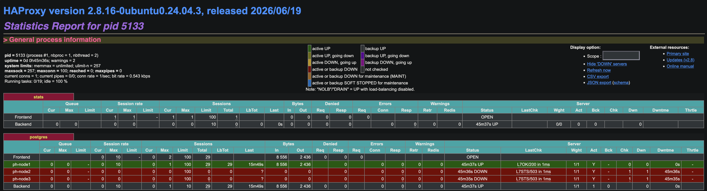

# PostgreSQL HA Lab — PostgreSQL + Patroni + etcd + HAProxy + keepalived


Ein selbst gebautes, hochverfügbares PostgreSQL-Cluster-Lab auf Proxmox — von den Grundlagen (Architektur, Replikation, manueller Failover) bis zum vollautomatisierten 3-Knoten-Failover mit Patroni, etcd, HAProxy und keepalived.

Entstanden als strukturiertes Lernprojekt, vollständig dokumentiert als Portfolio-Nachweis.

---

## Architektur

```
                    ┌─────────────────────┐
                    │   Virtuelle IP       │
                    │  192.168.178.200     │  ← keepalived (VRRP)
                    └──────────┬───────────┘
                               │
                    ┌──────────▼───────────┐
                    │       HAProxy         │  ← routet nur zum aktuellen Primary
                    │  (fragt Patroni REST- │     (Health-Check über Port 8008)
                    │   API auf Port 8008)  │
                    └──────────┬───────────┘
                               │
        ┌──────────────────────┼──────────────────────┐
        │                      │                      │
┌───────▼────────┐   ┌─────────▼───────┐   ┌──────────▼──────┐
│   ph-node1      │   │    ph-node2      │   │    ph-node3      │
│ 192.168.178.201 │   │ 192.168.178.202  │   │ 192.168.178.203  │
│                 │   │                  │   │                  │
│  PostgreSQL 16  │   │  PostgreSQL 16   │   │  PostgreSQL 16   │
│  Patroni        │   │  Patroni         │   │  Patroni         │
│  etcd           │   │  etcd            │   │  etcd            │
└─────────────────┘   └──────────────────┘   └──────────────────┘
        └──────────────────── etcd/Raft-Konsensus ─────────────────┘
              (Mehrheitsprinzip entscheidet, wer Primary ist)
```

---

## Live-Nachweis: HAProxy-Routing



Das eingebaute HAProxy-Stats-Dashboard (Port `7000`) zeigt live, dass Client-Traffic ausschließlich zur aktuellen Primary (`ph-node1`, grün) geroutet wird — die beiden Replicas werden korrekt aus dem Schreib-Pool ausgeschlossen (rot, weil Patronis REST-API dort `503` statt `200` liefert). Details zur Interpretation im [Tutorial-Dokument](./TUTORIAL.md#teil-10--haproxy-automatisches-routing-zur-aktuellen-primary).

---

## Tech-Stack

| Komponente | Version / Rolle |
|---|---|
| **PostgreSQL 16** | Relationale Datenbank |
| **Patroni** | Automatisiert Leader-Election, Failover, Replikationsverwaltung |
| **etcd** | Verteilter Konsensus-Store (Raft), verhindert Split-Brain |
| **HAProxy** | Routet Client-Traffic ausschließlich zum aktuellen Primary |
| **keepalived** | Virtuelle IP (VRRP) als stabiler Einstiegspunkt |
| **Proxmox VE** | Virtualisierungsplattform für die 3 Cluster-Knoten |
| **Ubuntu Server** | 24.04 LTS, je Knoten |

---

## Setup & Reproduzierbarkeit

Wer dieses Lab selbst nachbauen möchte, findet den vollständigen Lernweg — alle Konzepte, Befehle, Konfigurationsdateien und Entscheidungen — im [Tutorial-Dokument](./TUTORIAL.md). Das Setup ist Schritt für Schritt reproduzierbar.

### Infrastruktur

- 3× Ubuntu Server 24.04 LTS VMs (2 vCPU / 4 GB RAM / 20 GB Disk)
- Netz: `192.168.178.0/24` (Heimnetz), statische IPs `.201`–`.203`, virtuelle IP `.200`
- Strategie: Template-Knoten (`ph-node1`) vollständig vorbereitet (Pakete installiert, noch keine knotenspezifische Config), dann zweimal geklont — knotenspezifisches Konfigurieren (IP, Hostname, machine-id, SSH-Keys) erst nach dem Klonen

### etcd-Cluster: Peer- vs. Client-Kommunikation

Jeder etcd-Knoten braucht zwei getrennte Adressen:
- **Peer-URL** (Port `2380`): Kommunikation der drei Knoten untereinander (Raft-Konsensus — Leader-Wahl, Log-Replikation)
- **Client-URL** (Port `2379`): Schnittstelle für Patroni ("wer ist aktuell Primary?")

**Listen**-Adressen legen fest, wo ein Knoten selbst lauscht; **Advertise**-Adressen sind die erreichbare Netz-IP, die den anderen Knoten mitgeteilt wird. Die `initial-cluster`-Liste (Name + Peer-URL je Knoten) muss auf allen drei Knoten identisch sein — sie ist das gemeinsame Adressbuch beim Cluster-Start. Volle Erklärung mit Beispiel-Configs im [Tutorial-Dokument](./TUTORIAL.md).

---

## Fortschritt

### ✅ Abgeschlossen

- [x] PostgreSQL-Grundlagen (Architektur, Rollen, MVCC/VACUUM, WAL)
- [x] Streaming-Replikation (manuell, Single-VM-Testumgebung)
- [x] Manueller Failover live durchgeführt & verstanden (Split-Brain-Problematik)
- [x] Konsensus-Theorie: etcd/Raft, Mehrheitsprinzip
- [x] Patroni-Konzept: Automatisierung des manuellen Failover-Prozesses
- [x] HAProxy- und keepalived-Konzept
- [x] `ph-node1` (VMID 201) in Proxmox provisioniert, PostgreSQL 16 + Patroni + etcd installiert
- [x] `ph-node2` / `ph-node3` per Klon erstellt und individualisiert (Hostname, IP, machine-id, SSH-Keys)
- [x] etcd-3-Knoten-Cluster konfiguriert
- [x] Patroni-Cluster konfiguriert und gestartet (ph-node1 Leader, ph-node2/ph-node3 Replicas, Lag = 0)
- [x] HAProxy konfiguriert (Health-Check gegen Patroni REST-API, routet automatisch zur Primary)
- [x] keepalived konfiguriert (virtuelle IP `192.168.178.200`, Unicast-VRRP, Track-Script gegen HAProxy — verifiziert: VIP korrekt auf ph-node1 gebunden, Ping + `psql` über die VIP erfolgreich)
- [x] Kompletter automatisierter Failover-Test durchgeführt (HAProxy auf Primary-Knoten gestoppt, VIP + Traffic sind automatisch zum nächsten Knoten gewandert, `psql` über die VIP blieb durchgehend erreichbar)

**Kernziel erreicht:** vollautomatisierter 3-Knoten-Failover ohne manuellen Eingriff, End-to-End verifiziert.

> Details zu den drei Bugs, die auf dem Weg dorthin gefunden und gefixt wurden (VRRP-`weight`-Logik, `enable_script_security`, Dateiberechtigungen), stehen in [Teil 12 des Tutorials](./TUTORIAL.md#teil-12--der-echte-failover-test-und-drei-bugs-unterwegs).

### 🔜 In Arbeit

- [ ] **`dvdrental` Demo-Datenbank einspielen** — über VIP `192.168.178.200` in den HA-Cluster laden, relationale Tabellenstruktur, `LEFT JOIN` / `INNER JOIN` / `GROUP BY` / `HAVING` mit echten Daten üben
- [ ] **Performance-Analyse mit `pgbench`** — Lasttest gegen den HA-Cluster, `EXPLAIN ANALYZE`, Index-Optimierung, `pg_stat_statements`
- [ ] **Backup-Strategie mit `pg_basebackup`** — Backup + Restore-Test + Cronjob + PITR (Point-in-Time Recovery) mit WAL-Archivierung

---

## Roadmap

Dieses Lab ist ein lebendes Projekt — der Cluster steht, die Grundlagen sind dokumentiert. Geplante Erweiterungen:

| # | Thema | Beschreibung |
|---|---|---|
| 1 | **Monitoring** | `pg_activity`, Prometheus + `postgres_exporter` + Grafana Dashboard |
| 2 | **Connection Pooling** | PgBouncer vor HAProxy schalten — reduziert Verbindungs-Overhead bei vielen Clients |
| 3 | **Sicherheitshärtung** | SSL/TLS für PostgreSQL-Verbindungen, `pg_hba.conf` Restriktionen, BSI IT-Grundschutz |
| 4 | **Parametrisiertes Setup-Skript** | `setup_patroni_node.sh --node-id 1 --ip 192.168.178.201` — Cluster reproduzierbar per Skript aufsetzen |
| 5 | **Read-only Load Balancing** | Replicas über separaten HAProxy-Port (z.B. `5433`) für Leseabfragen nutzen |
| 6 | **Switchover vs. Failover** | `patronictl switchover` (kontrolliert) vs. automatischer Failover — Unterschied live demonstrieren |
| 7 | **pg_upgrade** | Versionswechsel (z.B. PostgreSQL 16 → 17) im laufenden Cluster dokumentieren |

---

## Dokumentation

Der vollständige Lernweg inkl. aller Konzepte, Befehle und Entscheidungen steht im [Tutorial-Dokument](./TUTORIAL.md).

Architektur inspiriert von [technotim.live — PostgreSQL High Availability](https://technotim.live/posts/postgresql-high-availability/), eigenständig auf Proxmox umgesetzt und dokumentiert.

---

## Autor

Erstellt von **Florian Englmeier** als praktisches Portfolio-Projekt im Rahmen der Weiterqualifizierung zum PostgreSQL-Datenbankadministrator.

[](https://linkedin.com/in/florian-englmeier-620949102)
[](https://github.com/florian-englmeier)

---

## Lizenz

MIT — siehe [LICENSE](./LICENSE).
