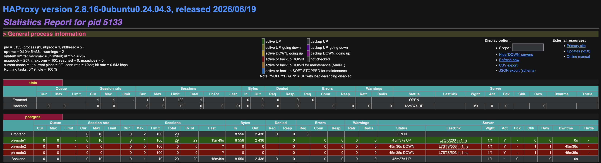

# PostgreSQL HA Lab — PostgreSQL + Patroni + etcd + HAProxy + keepalived


Ein selbst gebautes, hochverfügbares PostgreSQL-Cluster-Lab auf Proxmox — von den Grundlagen (Architektur, Replikation, manueller Failover) bis zum vollautomatisierten 3-Knoten-Failover mit Patroni, etcd, HAProxy und keepalived — inklusive Backup/PITR, Performance-Analyse und Monitoring mit Prometheus.

Entstanden als strukturiertes Lernprojekt, vollständig dokumentiert als Portfolio-Nachweis.

---

## Architektur

```
                    ┌─────────────────────┐
                    │  pg-vip.home.arpa    │  ← DNS-Name (Pi-hole)
                    │   Virtuelle IP       │
                    │  192.168.178.200     │  ← keepalived (VRRP)
                    └──────────┬───────────┘
                               │
                    ┌──────────▼───────────┐
                    │       HAProxy         │  ← routet nur zum aktuellen Primary
                    │  (fragt Patroni REST- │     (Health-Check über Port 8008)
                    │   API auf Port 8008)  │
                    └──────────┬───────────┘
                               │
        ┌──────────────────────┼──────────────────────┐
        │                      │                      │
┌───────▼────────┐   ┌─────────▼───────┐   ┌──────────▼──────┐
│   ph-node1      │   │    ph-node2      │   │    ph-node3      │
│ 192.168.178.201 │   │ 192.168.178.202  │   │ 192.168.178.203  │
│                 │   │                  │   │                  │
│  PostgreSQL 16  │   │  PostgreSQL 16   │   │  PostgreSQL 16   │
│  Patroni        │   │  Patroni         │   │  Patroni         │
│  etcd           │   │  etcd            │   │  etcd            │
└─────────────────┘   └──────────────────┘   └──────────────────┘
        └──────────────────── etcd/Raft-Konsensus ─────────────────┘
              (Mehrheitsprinzip entscheidet, wer Primary ist)

┌──────────────────────────────────────────────────────────────────────┐
│ ph-monitor 192.168.178.204 — Prometheus (9090) + Grafana (3000)      │
│ sammelt per Pull: node_exporter :9100 · postgres_exporter :9187 ·    │
│                   Patroni-Metriken :8008 — von allen drei Knoten     │
└──────────────────────────────────────────────────────────────────────┘
```

---

## Live-Nachweis: HAProxy-Routing



Das eingebaute HAProxy-Stats-Dashboard (Port `7000`) zeigt live, dass Client-Traffic ausschließlich zur aktuellen Primary (`ph-node1`, grün) geroutet wird — die beiden Replicas werden korrekt aus dem Schreib-Pool ausgeschlossen (rot, weil Patronis REST-API dort `503` statt `200` liefert). Details zur Interpretation im [Tutorial-Dokument](./PostgreSQL_und_Patroni_Tutorial.md#teil-10--haproxy-automatisches-routing-zur-aktuellen-primary).

---

## Tech-Stack

| Komponente | Version / Rolle |
|---|---|
| **PostgreSQL 16** | Relationale Datenbank |
| **Patroni** | Automatisiert Leader-Election, Failover, Replikationsverwaltung |
| **etcd** | Verteilter Konsensus-Store (Raft), verhindert Split-Brain |
| **HAProxy** | Routet Client-Traffic ausschließlich zum aktuellen Primary |
| **keepalived** | Virtuelle IP (VRRP) als stabiler Einstiegspunkt |
| **Prometheus** | Sammelt Metriken von 11 Zielen (Pull-Prinzip, 15-s-Intervall) |
| **node_exporter / postgres_exporter** | Betriebssystem- und Datenbank-Metriken je Knoten; Exporter mit eigener `pg_monitor`-Rolle |
| **Grafana** | Dashboards: Node Exporter Full (1860), PostgreSQL (9628); eigenes HA-Dashboard in Arbeit |
| **Pi-hole** | Lokaler DNS: `pg-vip.home.arpa` → VIP |
| **Proxmox VE** | Virtualisierungsplattform für die 3 Cluster-Knoten |
| **Ubuntu Server** | 24.04 LTS, je Knoten |

---

## Setup & Reproduzierbarkeit

Wer dieses Lab selbst nachbauen möchte, findet den vollständigen Lernweg — alle Konzepte, Befehle, Konfigurationsdateien und Entscheidungen — im [Tutorial-Dokument](./PostgreSQL_und_Patroni_Tutorial.md). Das Setup ist Schritt für Schritt reproduzierbar.

### Infrastruktur

- 3× Ubuntu Server 24.04 LTS VMs (2 vCPU / 4 GB RAM / 20 GB Disk)
- 1× Monitoring-VM `ph-monitor` (VMID 204, `192.168.178.204`, 2 vCPU / 2 GB / 20 GB) — bewusst getrennt vom Cluster, damit das Monitoring Knotenausfälle überlebt
- Netz: `192.168.178.0/24` (Heimnetz), statische IPs `.201`–`.203`, virtuelle IP `.200`
- Strategie: Template-Knoten (`ph-node1`) vollständig vorbereitet (Pakete installiert, noch keine knotenspezifische Config), dann zweimal geklont — knotenspezifisches Konfigurieren (IP, Hostname, machine-id, SSH-Keys) erst nach dem Klonen

### etcd-Cluster: Peer- vs. Client-Kommunikation

Jeder etcd-Knoten braucht zwei getrennte Adressen:
- **Peer-URL** (Port `2380`): Kommunikation der drei Knoten untereinander (Raft-Konsensus — Leader-Wahl, Log-Replikation)
- **Client-URL** (Port `2379`): Schnittstelle für Patroni ("wer ist aktuell Primary?")

**Listen**-Adressen legen fest, wo ein Knoten selbst lauscht; **Advertise**-Adressen sind die erreichbare Netz-IP, die den anderen Knoten mitgeteilt wird. Die `initial-cluster`-Liste (Name + Peer-URL je Knoten) muss auf allen drei Knoten identisch sein — sie ist das gemeinsame Adressbuch beim Cluster-Start. Volle Erklärung mit Beispiel-Configs im [Tutorial-Dokument](./PostgreSQL_und_Patroni_Tutorial.md).

---

## Fortschritt

### ✅ Abgeschlossen

**Grundlagen & Replikation (Single-VM)**
- [x] PostgreSQL-Architektur: Cluster, PGDATA, Rollen, MVCC/VACUUM, WAL
- [x] Streaming-Replikation von Hand aufgesetzt, Replica read-only verifiziert
- [x] Manueller Failover per `pg_ctl promote`, Split-Brain-Problematik verstanden
- [x] Konsens-Theorie: etcd/Raft, Quorum, warum ungerade Knotenzahl

**HA-Cluster auf Proxmox (3 Knoten)**
- [x] Template-Knoten `ph-node1` vorbereitet, zweimal geklont und individualisiert (Hostname, IP, machine-id, SSH-Keys)
- [x] etcd-3-Knoten-Cluster, Patroni-Cluster (Leader + 2 Replicas, Lag = 0)
- [x] HAProxy mit Health-Check gegen die Patroni-REST-API, routet automatisch zur Primary
- [x] keepalived mit virtueller IP `192.168.178.200` (Unicast-VRRP, Track-Script); drei Bugs beim Aufsetzen gefunden und behoben
- [x] Automatischer Failover-Test Ende-zu-Ende: VIP und Traffic wandern, `psql` über die VIP bleibt erreichbar
- [x] DNS-Name `pg-vip.home.arpa` über Pi-hole: Name → VIP → HAProxy → Leader verifiziert
- [x] Ausfalltest des VIP-Halters gemessen: VIP-Umzug ~3 s, Anwendung ~5 s verzögert ohne Fehler, kein Patroni-Failover

**Backup & Recovery**
- [x] Logisches Backup `pg_dump` / `pg_restore` mit Restore-Test
- [x] Physisches Backup `pg_basebackup`, WAL-Archivierung über `patronictl edit-config`
- [x] Point-in-Time-Recovery sekundengenau auf isolierter Testinstanz bewiesen
- [x] Archiv-Lücke nach Failover per `pg_stat_archiver` gefunden und behoben

**Performance & Query-Analyse**
- [x] `pgbench`-Sättigungskurve (10/50/90 Clients), Durchsatz-Latenz-Trade-off, Lasttest über VIP mit 0 % Fehlern
- [x] `EXPLAIN ANALYZE`: Seq Scan vs. Index Scan, Selektivität, Collation-Falle (`de_DE.UTF-8`) mit `text_pattern_ops` gelöst

**Betrieb & Härtung**
- [x] Patroni-Autostart war auf allen Knoten deaktiviert, behoben und per Neustart-Test bestätigt
- [x] `/etc/patroni.yml` (enthält Passwörter) von weltlesbar auf `root:postgres 640`

**Monitoring**
- [x] Eigene Monitoring-VM `ph-monitor`, getrennt vom Cluster
- [x] node_exporter, Patroni-Metriken, postgres_exporter mit `pg_monitor`-Rolle (inkl. Passwort-Rotation)
- [x] Prometheus mit 11/11 Zielen `UP`
- [x] Grafana mit Prometheus-Datenquelle, Dashboards 1860 (Node Exporter Full) und 9628 (PostgreSQL)
- [x] Befund aus dem Dashboard: `shared_buffers` und weitere Parameter stehen noch auf Werkseinstellung

**Kernziel erreicht:** vollautomatisierter 3-Knoten-Failover ohne manuellen Eingriff, Ende-zu-Ende verifiziert — inklusive Backup/PITR, Performance-Nachweis, Query-Analyse und Monitoring.

> Details zu den drei Bugs beim Aufsetzen von keepalived (VRRP-`weight`-Logik, `enable_script_security`, Dateiberechtigungen) stehen in [Teil 12 des Tutorials](./PostgreSQL_und_Patroni_Tutorial.md#teil-12--der-echte-failover-test-und-drei-bugs-unterwegs).

### 🔜 Als Nächstes

- [ ] Eigenes HA-Dashboard in Grafana: Leader-Status, Replikations-Lag, Cache-Hit-Ratio, Connections
- [ ] Platten der Knoten per `lvextend` auf volle Größe erweitern (WAL-Archiv wächst)
- [ ] Lasttest mit `pgbench` von `ph-monitor` aus (getrennter Lastgenerator), live im Dashboard
- [ ] Failover unter Last, im Dashboard sichtbar gemacht
- [ ] Basis-Tuning (`shared_buffers` u. a.) per `patronictl edit-config` und rollierendem Restart

---

## Roadmap

Dieses Lab ist ein lebendes Projekt — der Cluster steht, die Grundlagen sind dokumentiert. Geplante Erweiterungen:

| # | Thema | Beschreibung |
|---|---|---|
| 1 | **Alerting** | Alertmanager-Regeln (Leader weg, Lag zu hoch, Archivierung fehlgeschlagen) statt Dashboards beobachten |
| 2 | **Connection Pooling** | PgBouncer vor HAProxy schalten — reduziert Verbindungs-Overhead bei vielen Clients |
| 3 | **Sicherheitshärtung** | 🔧 begonnen (Dateirechte `patroni.yml`, Exporter-Config) — offen: `keepalived.conf`, SSL/TLS, `pg_hba.conf` Restriktionen, BSI IT-Grundschutz |
| 4 | **Automatisierung mit Ansible** | Cluster-Aufbau als Ansible-Rolle — reproduzierbar statt Schritt-für-Schritt von Hand |
| 5 | **Read-only Load Balancing** | Replicas über separaten HAProxy-Port (z.B. `5433`) für Leseabfragen nutzen |
| 6 | **Switchover vs. Failover** | `patronictl switchover` (kontrolliert) vs. automatischer Failover — Unterschied live demonstrieren |
| 7 | **pg_upgrade** | Versionswechsel (z.B. PostgreSQL 16 → 17) im laufenden Cluster dokumentieren |
| 8 | **CloudNativePG** | PostgreSQL-HA auf Kubernetes (on-prem) als Gegenstück zum Patroni-Ansatz |

---

## Dokumentation

Der vollständige Lernweg inkl. aller Konzepte, Befehle und Entscheidungen steht im [Tutorial-Dokument](./PostgreSQL_und_Patroni_Tutorial.md).

Zum Wiederholen:
- [Kontrollfragen](./Kontrollfragen.md) — 137 Fragen mit Antworten, nach Themen sortiert (A–M)
- [Merksätze](./Merksaetze.md) — die wichtigsten Faustregeln und Lehren aus dem Lab

Architektur inspiriert von [technotim.live — PostgreSQL High Availability](https://technotim.live/posts/postgresql-high-availability/), eigenständig auf Proxmox umgesetzt und dokumentiert.

---

## Autor

Erstellt von **Florian Englmeier** als praktisches Portfolio-Projekt im Rahmen der Weiterqualifizierung zum PostgreSQL-Datenbankadministrator.

[](https://linkedin.com/in/florian-englmeier-620949102)
[](https://github.com/florian-englmeier)

---

## Lizenz

MIT — siehe [LICENSE](./LICENSE).
